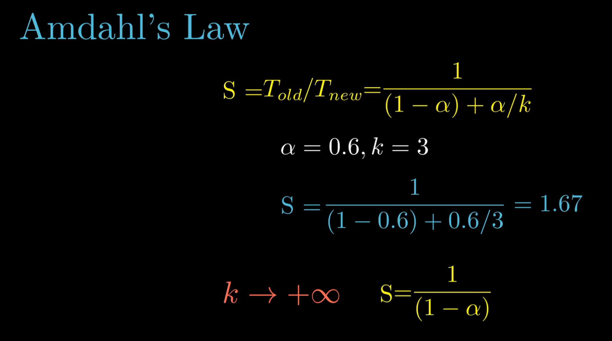
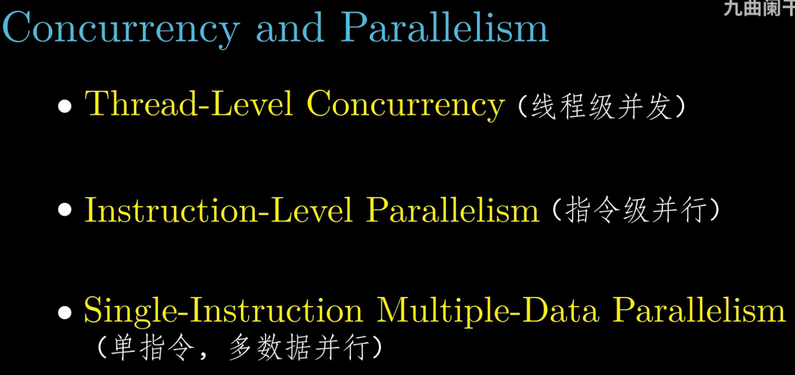
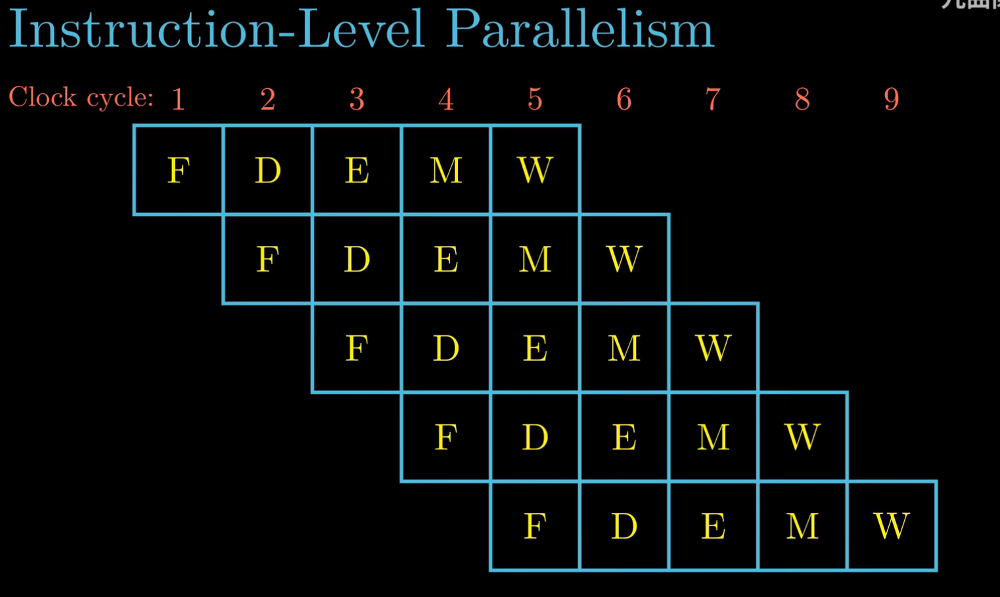
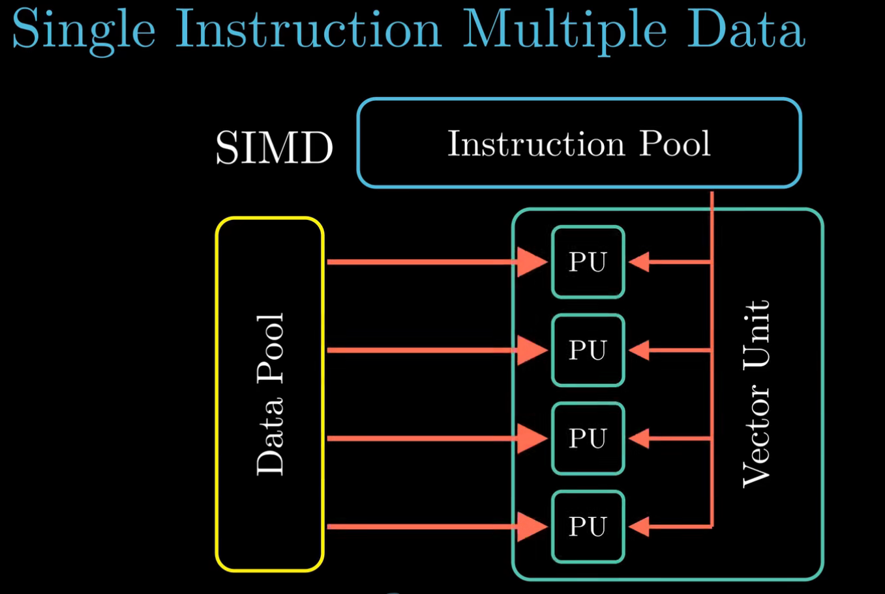

## Chapter 1。 计算机系统漫游
- Amdahl's Law
  - $k$ 为加速比， $\alpha$ 为可加速部分占比

  

- How to speed up?
  
  
  
  - Threading level concurrency
    - Mordern processor can have multiple CPUs. And different CPU can share same L3 cache. So multiple threads can enhance efficiency.
    - Q1: What's `hyperthreading` processor ?
      - Inner CPU has multiple PCs and register files, but single FA(浮点运算部件)，so we need to switch between threads to finish each calculation. Normal single thread processor takes ~`20000` periods to switch between threads, but `hyperthreading` processor can decide which thread to be executed within one period, switching thread takes significant cost and then utilize CPU resources efficiently. 
    

  
  - Instruction level parallelsim

    
  
    - Q1: What is `SIMD`?
      - Single Instruction Multiple Data
      
      

