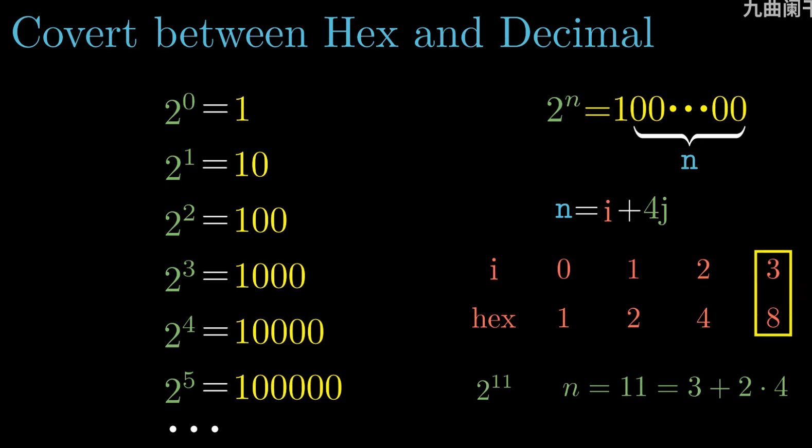
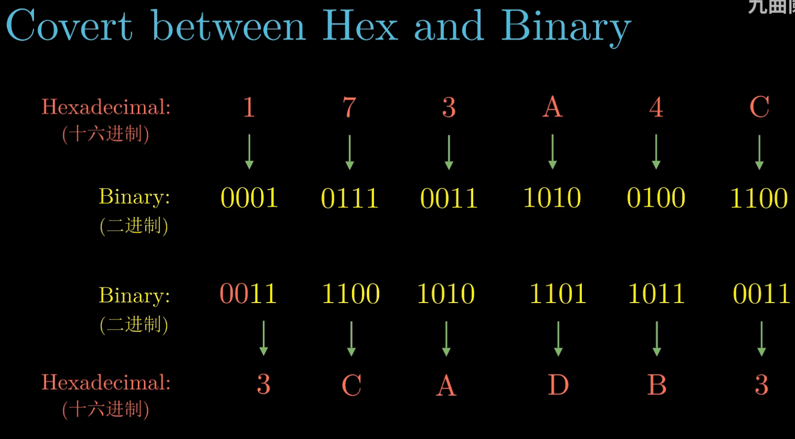
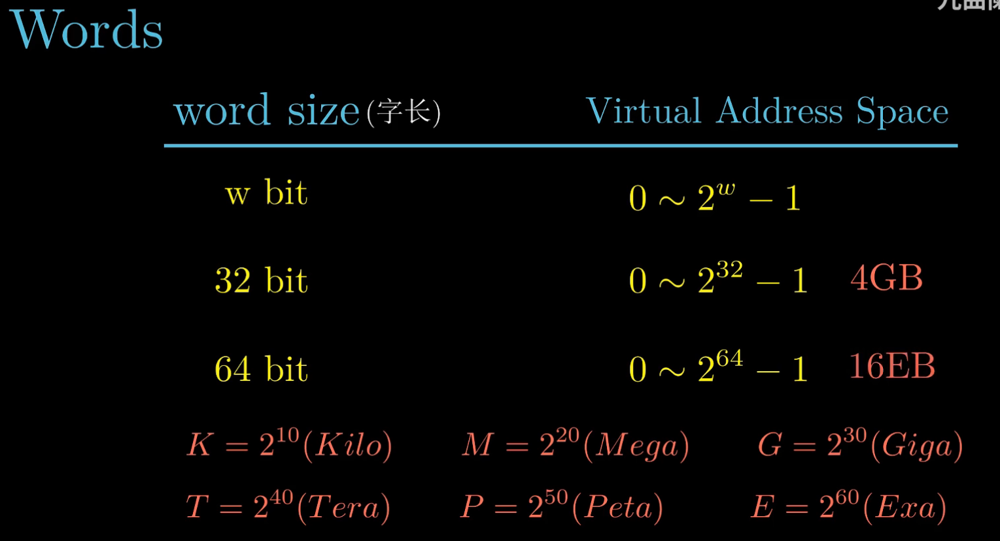
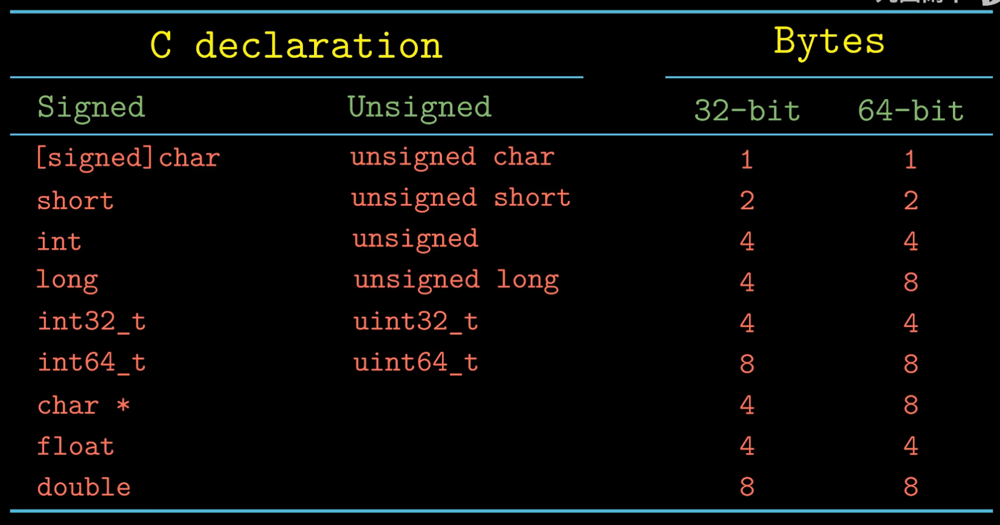
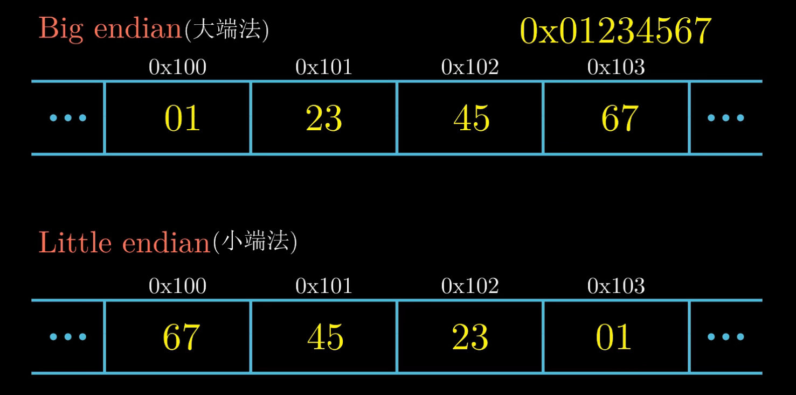
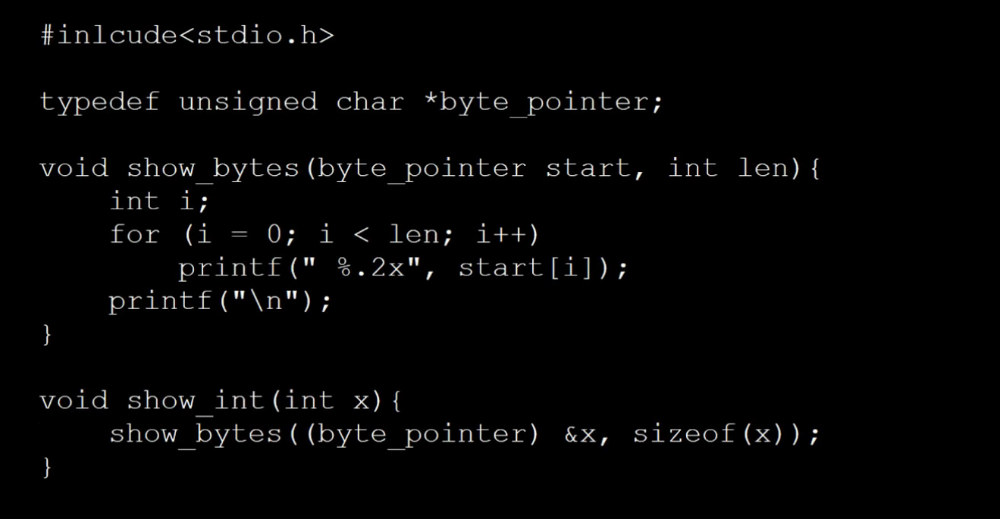
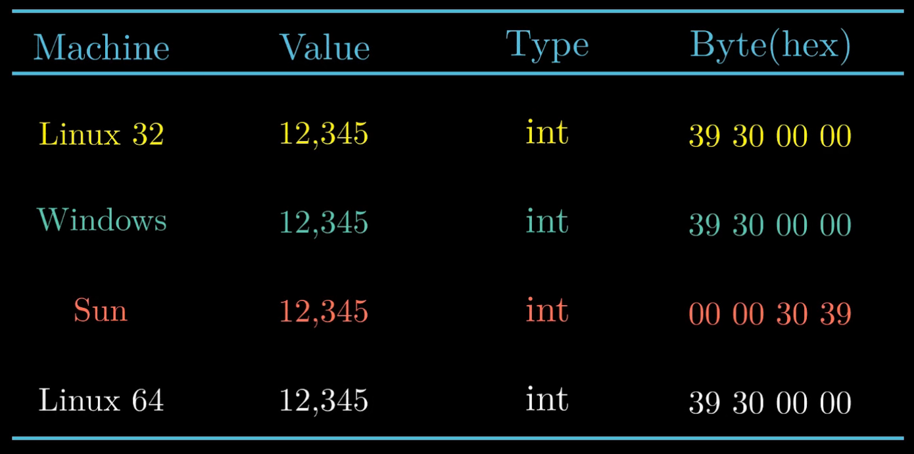
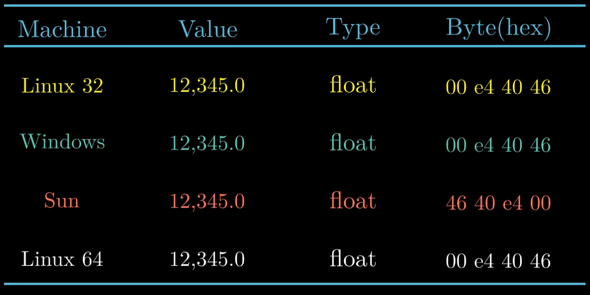
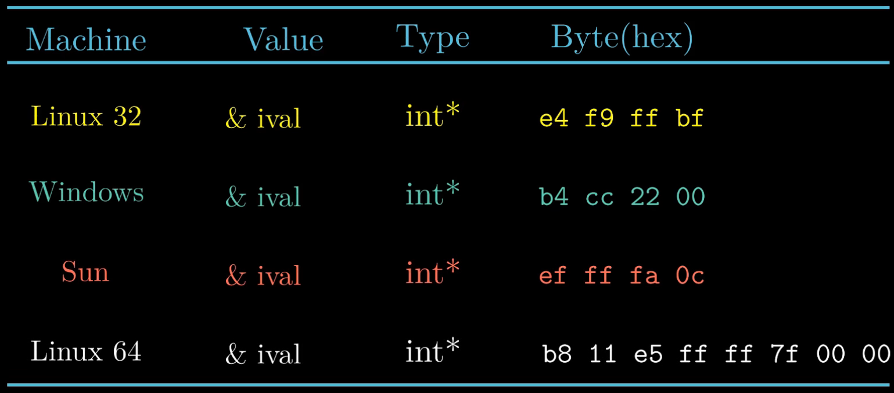
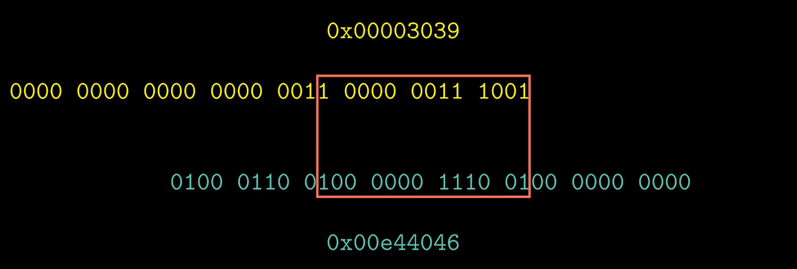

# Chapter 2 信息的存储

- 一些进制转换方式
  

  

  

  

- Big Little Endian
  
  

  - Android and IOS
    - Little Endian
  
- A C program to print byte and their address

  
  
  - Results for same  `integer` value but different endian in different machine
  
    

  - Results for same  `float` value but different endian in different machine
    
    

  - Results for same  `integer` address but different endian in different machine

    

  - Same value of `int` and `float`, hex representation has some overlap, is this a coincidence?

    