Chapter 2 整数的表示

## 一些运算准则

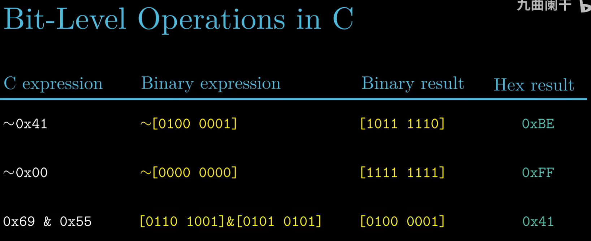

- 逻辑右移 和 算术右移 有什么区别？
  
  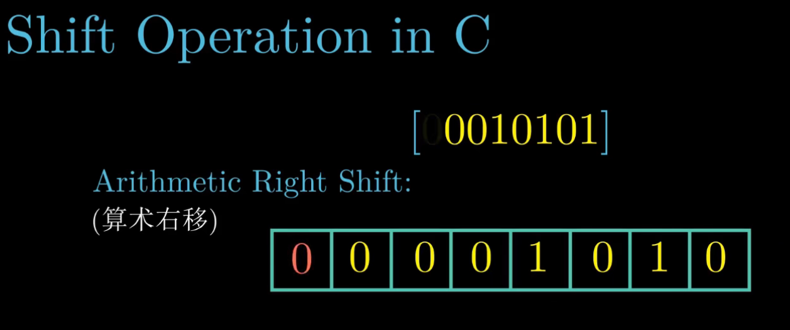

  - 什么时候算术右移，什么时候逻辑右移？
    - 无符号数逻辑右移
    - 有符号数算术右移

- 不同数据类型和他们能表示的数字范围
  
  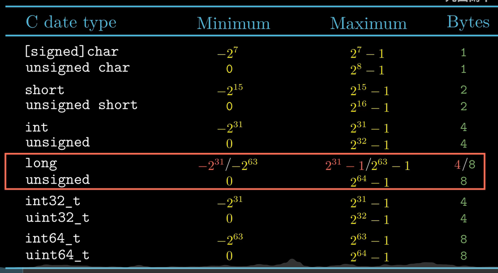
  
  - 注意 `long` 类型，在32-bi系统中只占 4 字节，但是 64-bit 系统中占 8 字节

- 无符号数的编码准则？
  
  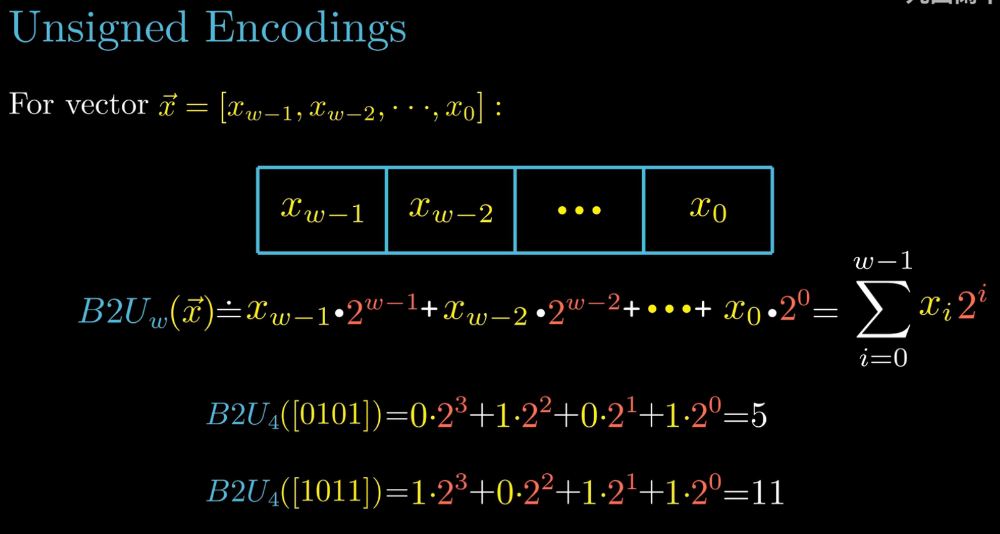

- 简图表示无符号数的计算
  
  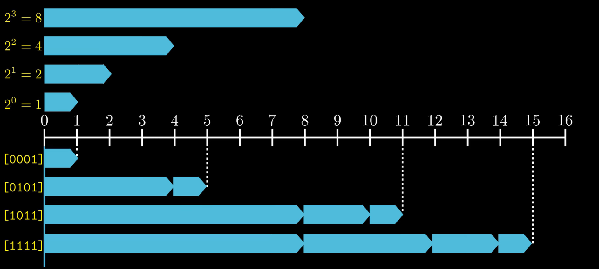

- 有符号数的编码准则/补码表示
  
  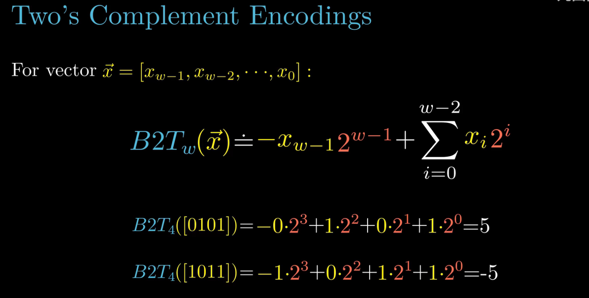

- 有符号数/补码的简图表示
  
  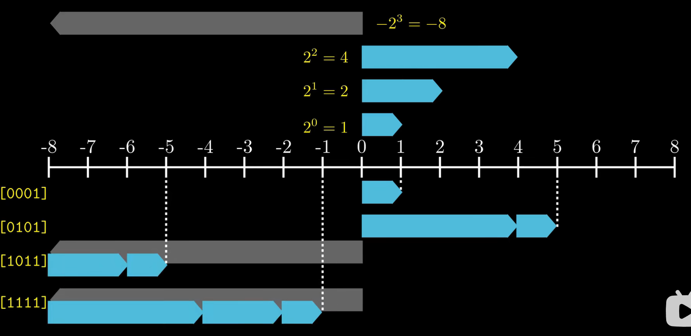

- 有符号数 `-1` 与 无符号数 能表示的最大数 二进制表示相同，但是其实不等 
  
  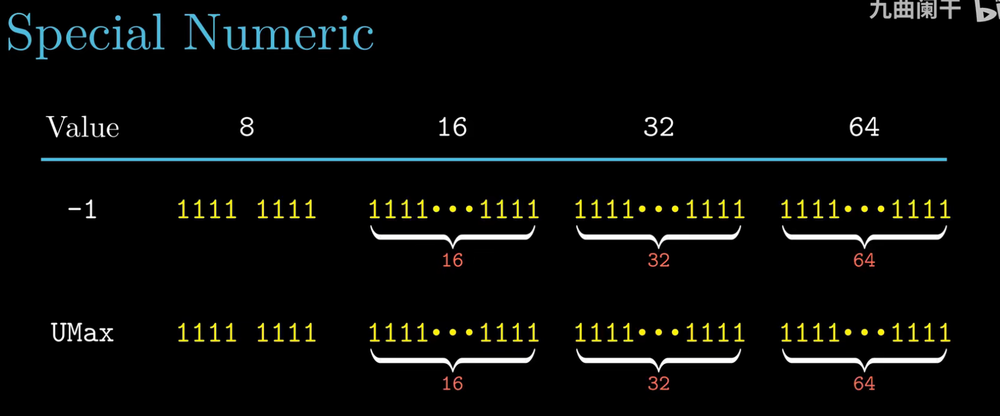

## 无符号数 和 有符号数 之间的转换
- C语言是如何区分有符号数和无符号数的呢？
  - 二进制表示相同的数，但是解释方式不同
    
    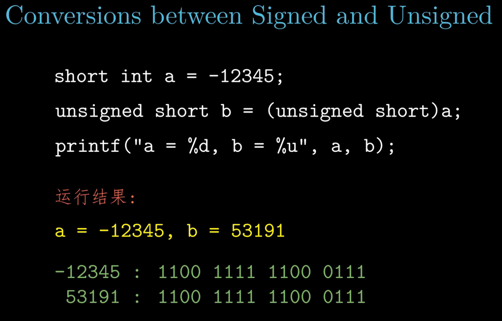

- 当二进制表示相同时，无符号数和有符号数之间的转换关系
  
  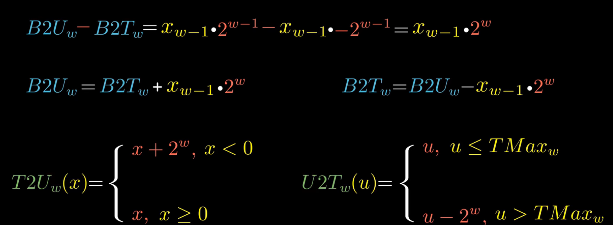

- 当一个有符号数 和 无符号数 进行运算时，会将 有符号数强制转换成无符号数进行运算

    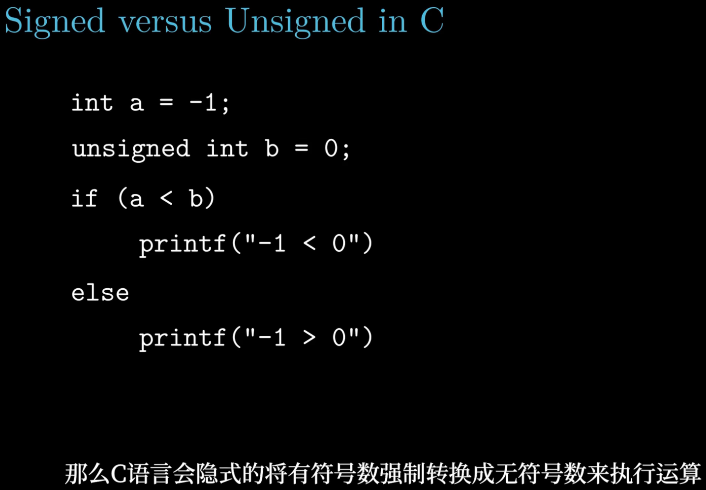

- 无符号数 向 更长类型 转换，前置位补零即可，又称 `zero expansion`

  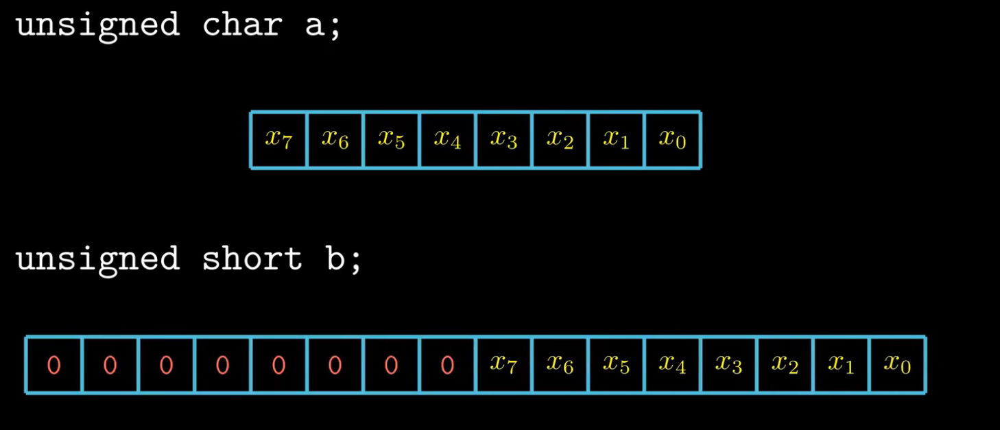

- 有符号数 是怎么向更长类型转换的呢？
  - 假如第一位是0，代表正数，前置位补零即可
  - 假如第一位是1，代表负数，前置位全部需要补 `1`
    - 可以用数学归纳法证明

      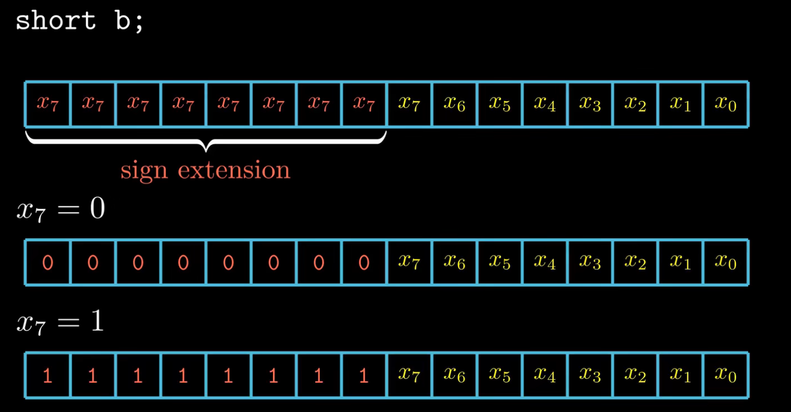

- 截断数：从 长类型 到 短类型
  - 显然无法保证 数值不变
  - 无符号容易理解，就是 m位 -> k位 mod 2^k 即可
  - 有符号数 截断如何处理？分两步：
    - 先通过 有符号 to 无符号 准则精确转换，再截断无符号数
    - 再通过 无符号 to 有符号 准则精确转换为 截断后的有符号数

    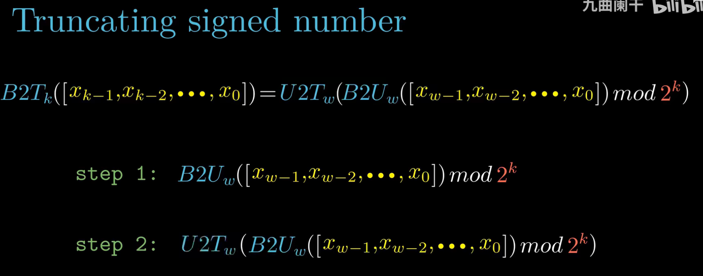
    