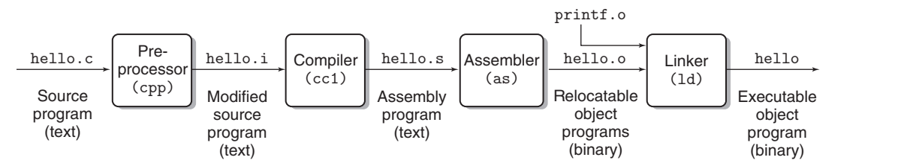

# Chapter 1: A Tour of Computer Systems

***

## The compilation system

```c
#include <stdio.h>

int main() {
    printf("hello world\n");
    return 0;
}
```



The gcc compiler driver reads the source file [hello.c](./hello.c) and translates it into an executable object file
hello. The translation is performed in the sequence of four phases. The programs that perform the four phases (
preprocessor, compiler, assembler, and linker) are known collectively as the compilation system.

### Preprocessing phase.

The preprocessor (cpp) modifies the original C program according to directives that begin with the ‘#’ character. For
example, the ```#include <stdio.h>``` command in line 1 of [hello.c](./hello.c) tells the preprocessor to read the
contents of the system header file stdio.h and insert it directly into the program text. The result is another C
program, typically with the .i suffix.

*We can use the following command to transfer a .c file to a .i file.*

```shell
gcc -E hello.c -o hello.i
```

### Compilation phase.

The compiler (cc1) translates the text file hello.i into the text file hello.s, which contains an assembly-language
program. This program includes the following definition of function main:

```asm
main:
    subq $8, %rsp
    movl $.LC0, %edi
    call puts
    movl $0, %eax
    addq $8, %rsp
    ret
```

*We can use the following command to transfer a .i file to a .s file.*

```shell
gcc -S hello.i -o hello.s
```

Assembly language is useful because it provides a common output language for different compilers for different
high-level languages. For example, C compilers and Fortran compilers both generate output files in the same assembly
language.

### Assembly phase.

Next, the assembler (as) translates hello.s into machine language instructions, packages them in a form known as a
relocatable object program, and stores the result in the object file hello.o. This file is a binary file containing 17
bytes to encode the instructions for function main. If we were to view hello.o with a text editor, it would appear to be
gibberish.

*We can use the following command to transfer a .s file to a .o file.*

```c
gcc -c hello.s -o hello.o
```

### Linking phase.

Notice that our hello program calls the printf function, which is part of the standard C library provided by every C
compiler. The printf function resides in a separate precompiled object file called printf.o, which must somehow be
merged with our hello.o program. The linker (ld) handles this merging. The result is the hello file, which is an
executable object file (or simply executable) that is ready to be loaded into memory and executed by the system.

*We can use the following command to transfer a .o file to an executable file.*

```c
gcc hello.o -o hello
```

### 总结

生成可执行程序过程为成四个步骤：

1. 由.c文件到.i文件，这个过程叫预处理。
2. 由.i文件到.s文件，这个过程叫编译。
3. 由.s文件到.o文件，这个过程叫汇编。
4. 由.o文件到可执行文件，这个过程叫链接。

***