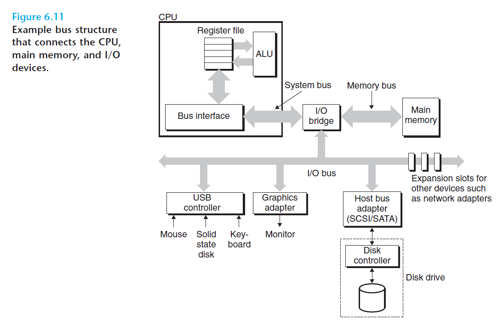

# Ch6 The Memory Hierarchy

## 6.1 Storage Technologies

**磁盘操作**

磁盘以扇区大小的块来读写时间，扇区的访问时间分为以下三个部分：

* 寻道时间：传送壁将读/写头定位到包含目标扇区的磁道上，移动传送壁所需的时间为寻道时间。现代驱动器的寻道时间通常为 3ms 到 9 ms，最大寻道时间可达 20 ms。
* 旋转时间：定位到磁道上后，驱动器等待目标扇区的第一个位旋转到读/写头的时间。最坏情况下必须等待磁盘旋转一整圈定位到目标扇区。
* 传送时间：读写该扇区的时间，主要依赖于旋转速度和每条磁道的扇区数目。

访问磁盘扇区主要的时间开销在**寻道时间和旋转时间**。

**逻辑磁盘块**

磁盘盘面上的记录信息复杂，为了隐藏复杂性，磁盘中有一个**磁盘控制器**的物理设备，维护磁盘逻辑块和物理磁盘扇区之间的映射关系。

每当操作系统需要执行 I/O 操作时，例如 load 一个磁盘扇区到主存，操作系统会先发送读逻辑块号的命令至磁盘控制器，然后由磁盘控制器将逻辑块号翻译成**（盘面，磁道，扇区）**的三元组，其对应了物理扇区的所在位置，最后将读到的数据放至磁盘控制器的缓冲区内，并将其复制到主存中。

**连接 I/O 设备**

I/O 总线结构如下图所示。

