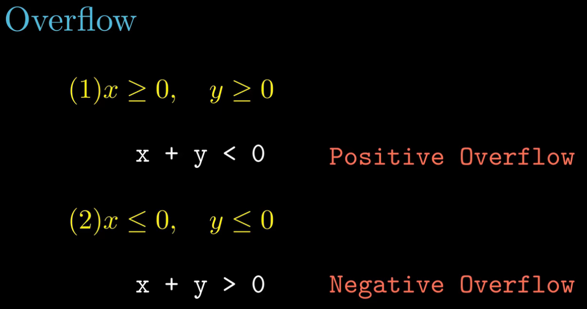
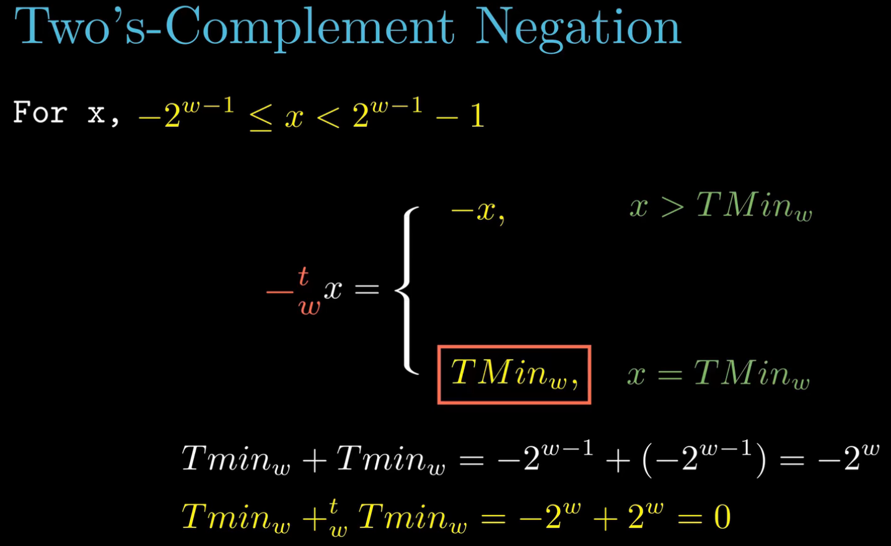

- Q1: 如何检测无符号数溢出？
- Q2: 为什么可以这样？

- 如何检测有符号数溢出？

- 无符号数加法逆元

- 有符号数加法逆元
  - $T_{min}$ 加法逆元 $x=T_{min}$

- 为什么两个相同位数，用二进制表示的无符号数和有符号数的乘积依然相同？
  - 怎么证明？

- 如何证明乘法可以用左移运算代替
  - 2的整数次幂
  - 如何推广到任意数？

- 除法取整的规则

- 二进制浮点数

- IEEE的浮点数表示规则

- 四种浮点数
  - 正规化
  - 非正规化
  - 无穷大
  - not a number, NaN

- 一个八位非正规化浮点数例子

- 一个八位正规化浮点数例子

