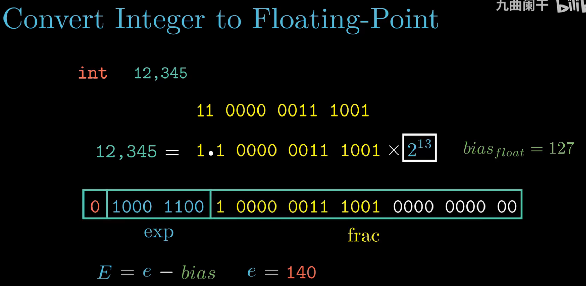
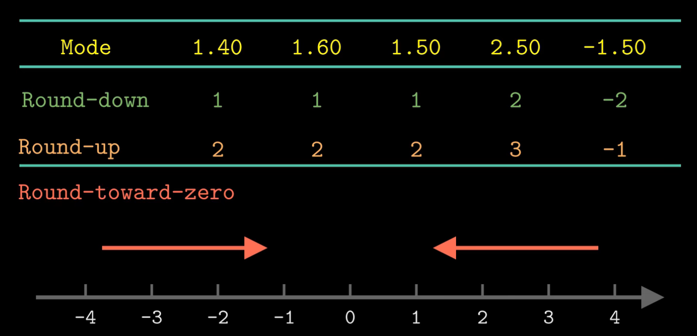
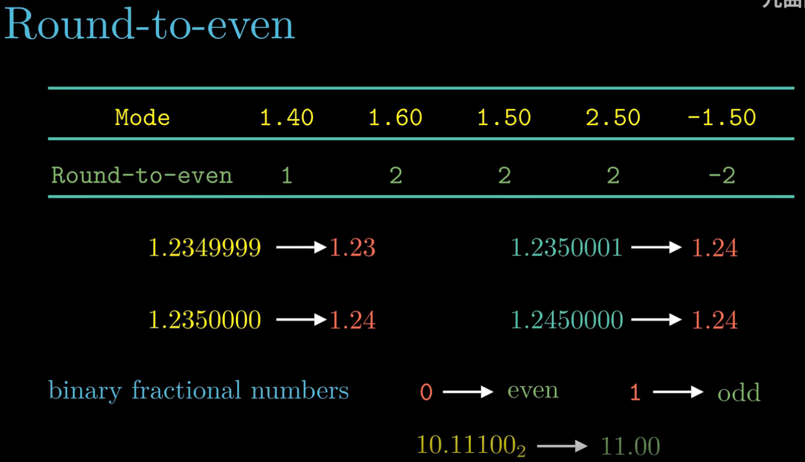
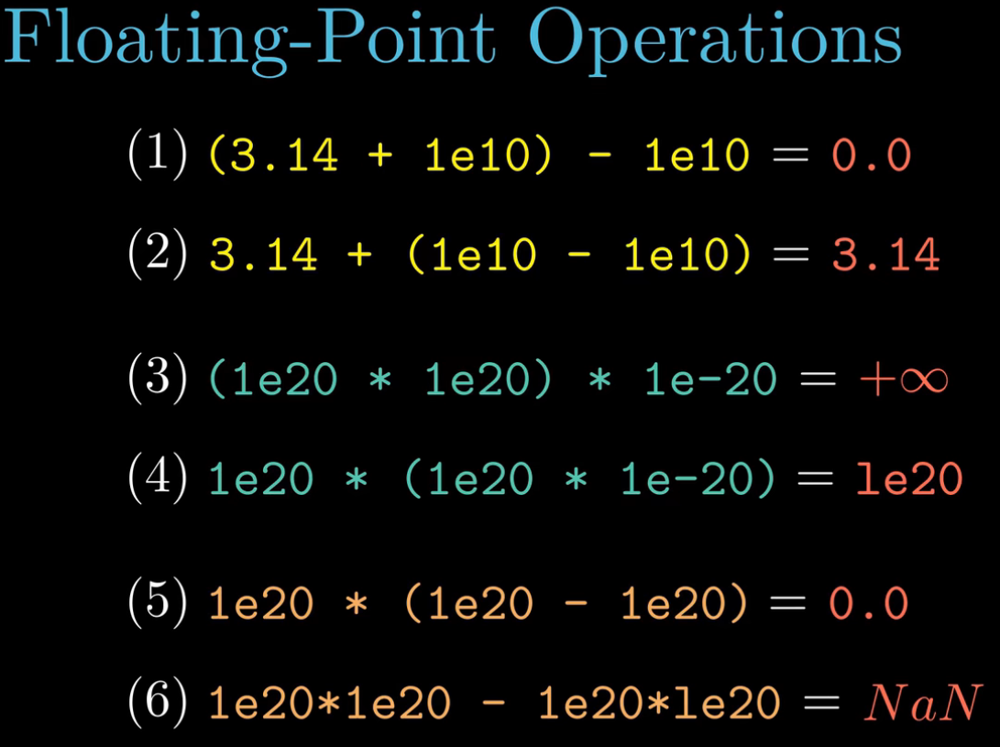
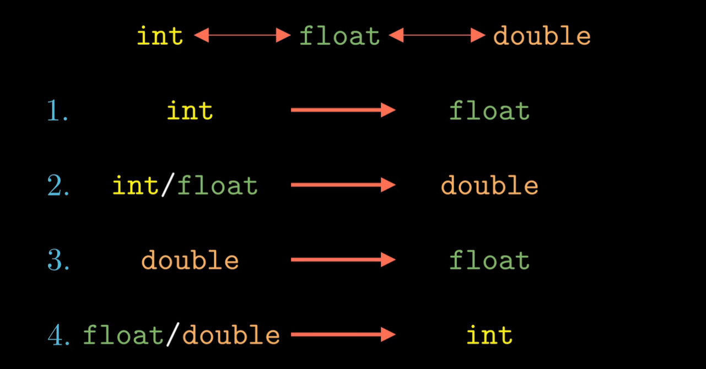

Q: 如何将一个整型数 $I$ 转成 IEEE 浮点数 $f$？
  - 先找到 $k=2^{E}$ 使得 $\frac{I}{k} = 1.x$
  - 将小数部分转成二进制表示 $x = a_1 \times 2^{-1} + a_2 \times 2^{-2}$
  - 按照 单/双精度 的小数部分的位数，补零
  - 根据 单/双精度 的 $bias$ 和 $E$ 计算 阶数 $e$
    - 本例中 $e = E + bias_{float} = 13 + 127 = 140 = 0b10001100$
  - 补齐首位补码 得到 $f=$ $0 \quad 1000 \, 1100 \quad 1 \, 0000 \, 0011 \, 1001 \, \quad 0000 \, 0000 \, 00$

  

- 四种舍入方式

  

- 向偶数位舍入
  - 总结就是说不管几进制和几位，我们希望使最低有效位为偶数

  

- 由于取整导致的浮点数失真例子

  

- 从上至下，能否保留精度？为什么
  - 否
  - 能
  - 否
  - 否

