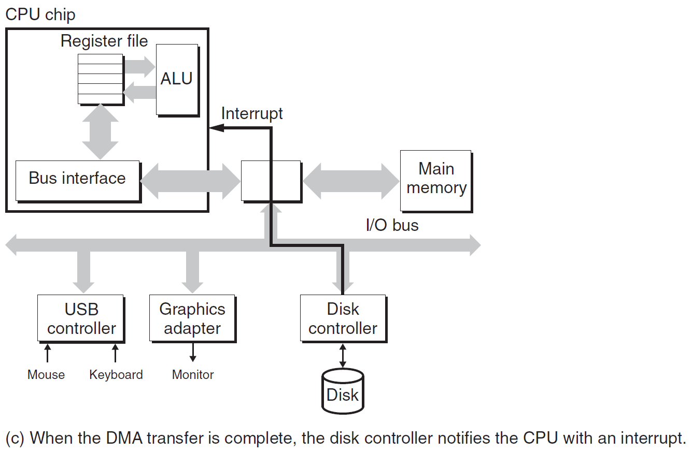

# Ch6 The Memory Hierarchy

## 6.1 Storage Technologies

**访问磁盘**

CPU 通过使用内存映射 I/O (memory-mapped I/O) 技术向 I/O 设备发送命令，地址空间中保留了 I/O 端口用于通信。

CPU 读一个磁盘扇区的操作如下：

1. 首先 CPU 将**读取命令**、**读取的磁盘逻辑块号**、**存储磁盘扇区的内存地址**发送至磁盘控制器。发送完毕后，CPU 可以转而区完成其它命令的执行。

2. 磁盘控制器收到上述命令后，将逻辑块号翻译成物理块号，将指定扇区的内容直接传送至主存（这个过程不需要 CPU 干预），这个过程即为 DMA （Direct Memory Access）

    

3. 完成传送后，磁盘控制器给 CPU 发送中断。此时的中断会发送信号至  CPU 芯片的一个外部引脚上，收到中断后，CPU 暂停当前工作，跳转至一个操作系统例程上，改例程记录 I/OP 完成，并将控制返回至 CPU 中断的地方。

    

    

### 6.1.3 SSD
* 由一个或多个闪存芯片和闪存翻译层组成。闪存翻译层的作用的磁盘控制器类似，将逻辑块翻译成物理块
* SSD 的随机写慢于顺序写，原因如下：
    * 擦除块的用时较长
    * 如果试图修改包含数据的页面，需要将该页面复制到新的块上，才能写某一页。

