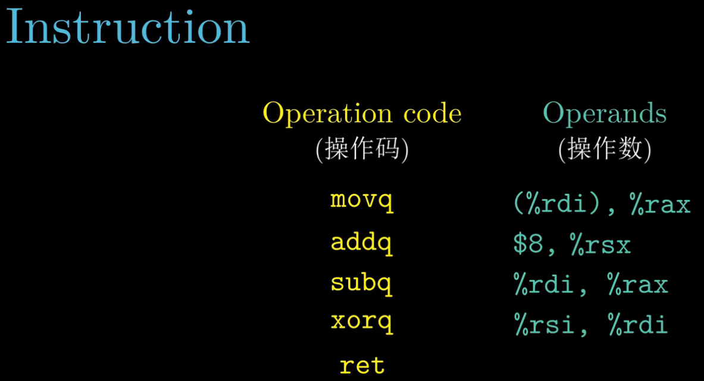

---
title: csapp-note-2022-05-01
tags:
  - csapp
  - 操作系统
  - 编译原理
  - CS基础知识
  - 读书笔记
cover: 'https://source.unsplash.com/random'
date: 2022-05-01 20:24:35
---

- `C` codes with assembly language comparison

  

- 16 types of registers
  
  

- register save strategy
  - Caller-saved
  - Callee-saved

  

- Summary of 16 registers required save strategy

  

- assembly-code suffix of size(bytes)

  

- assembly-code with decoded assembly-code

  

- Use cases of 16 types of registers

  

- Examples of operands/operation code

  

- Three types of operands
  - Immediate
  - Register
  - Memory reference

  

- How a memory reference is calculated?

  

- More memory reference examples

  

- Data move instructions examples

  

