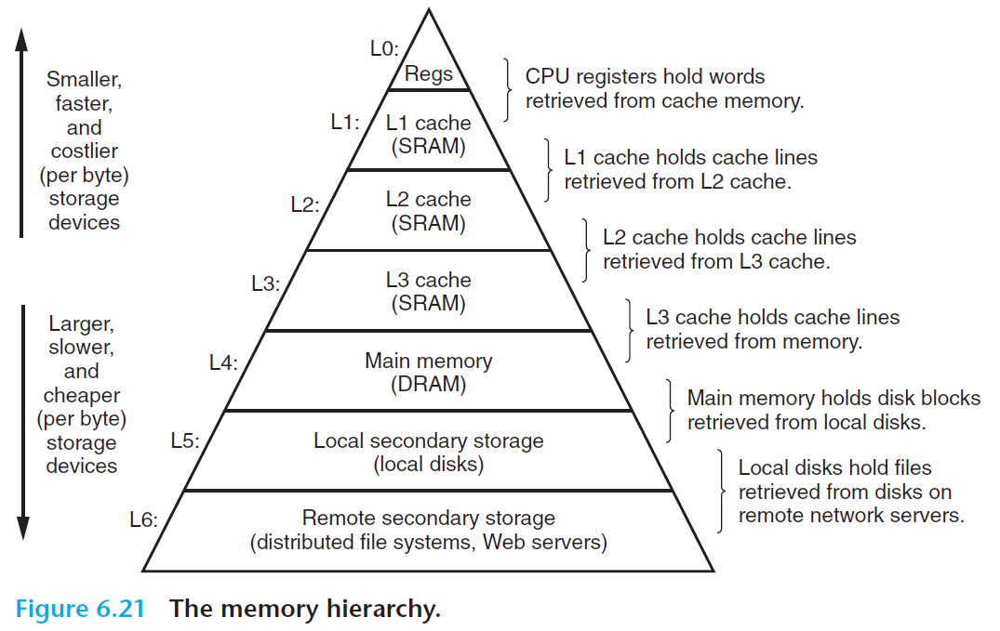

# Ch6 The Memory Hierarchy

## 6.3 The Memory Hierarchy

存储器层次结构：

**Caching in the Memory Hierarchy** 

cache 是一个小而快的存储设备，作为存储在更大更慢的设备中的数据对象的缓冲区域。如上图，层次结构中的每一层都缓存都缓存来自较低一层的数据对象。

在访问缓存中时，如果缓存命中（cache hit），可以有更好的性能优化。缓存不命中，则需要去下一层取数据，产生额外的性能开销。

缓存不命中的种类：

* 冷不命中（cold miss or compulsory miss）
* 冲突不命中（conflict miss）：由某写限制性的放置策略导致的
* 容量不命中（capacity miss）

不同缓存类型的相关信息：

