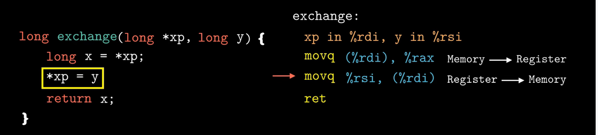
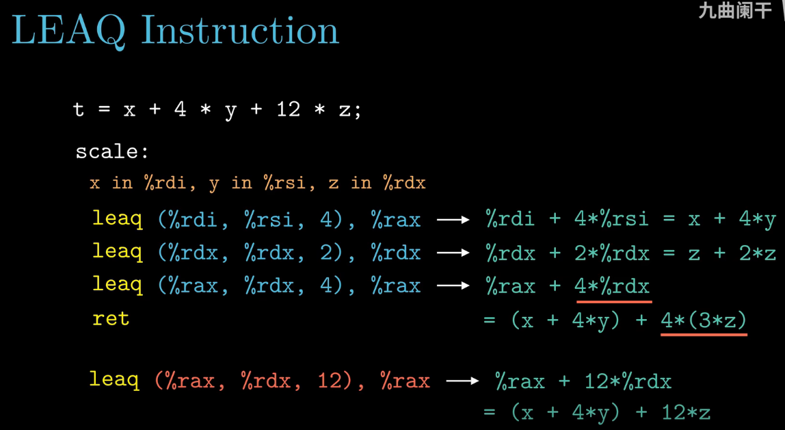
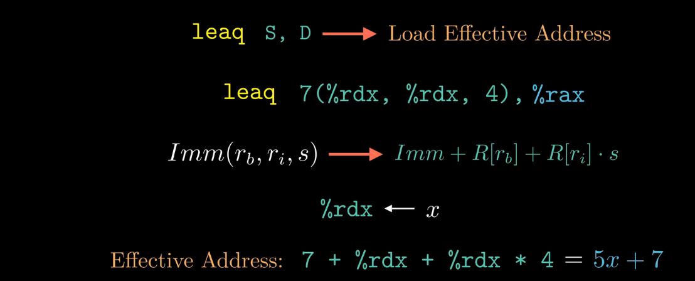
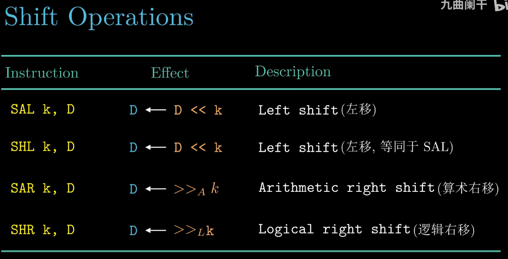
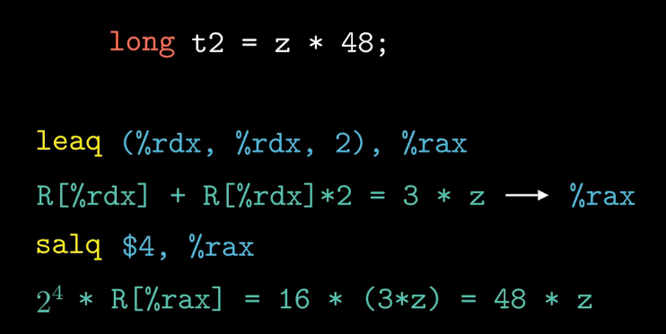

- An example comparison of how exchange is implemented by pure instructions

  

- How the parameter is saving in registers?
  - `%rdi`, `%rsi`, `%rdx`

- Why can't calculate `12*z` directly?
  - Since amplifier should be only `1` `2` or `4` and `8` 

    

- Though it looks like a memory reference, it's direcly adding the results of operation

  

- Some shifts instruction examples

  

- Mutiple takes more time than shift so compiler may choose the optimal shift instruction first than multiply

  

