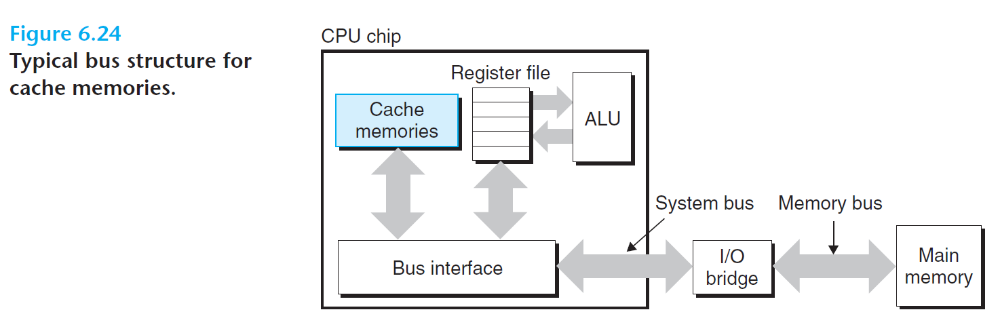
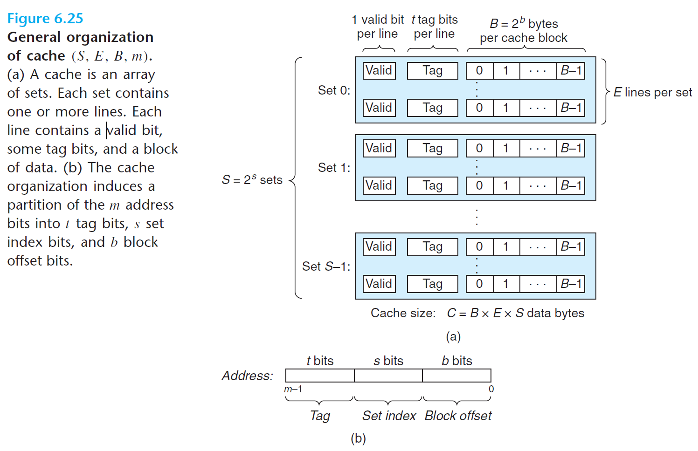
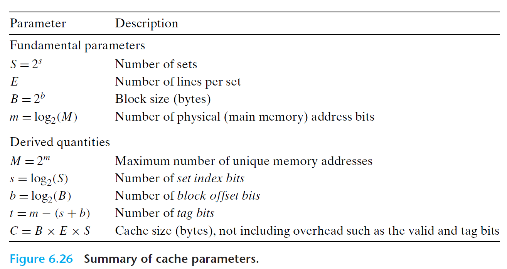
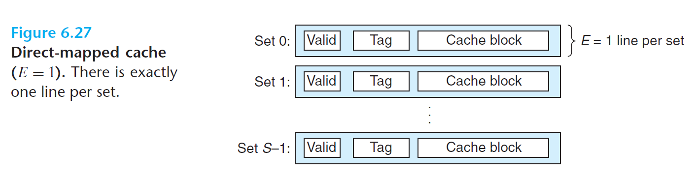
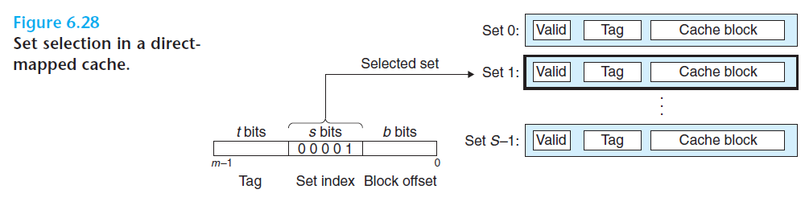
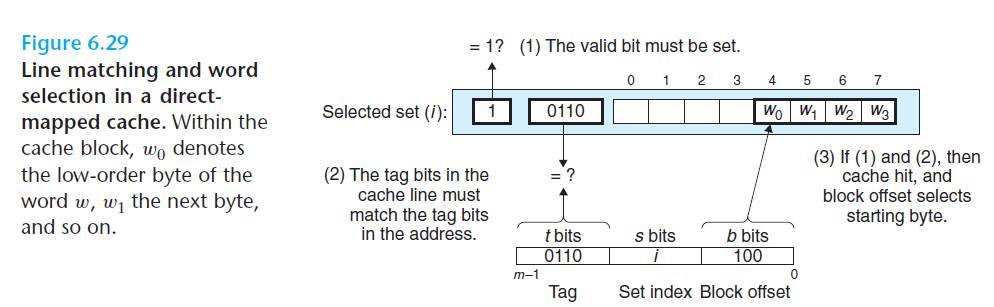
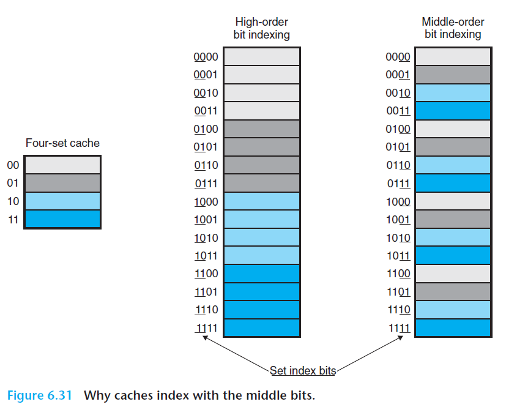

# Ch6 The Memory Hierarchy

## 6.4 Cache Memories

cache 在 CPU 芯片中的总线结构。

### 6.4.1 Generic Cache Memory Organization

cache 的组织结构如下：

* 存储器的地址空间为 $m$ 位，共有 $M = 2^{m}$ 个地址
* cache 有 $S = 2^{S}$ 个高速缓存组（cache set），每组包括 E 个 cache line，每个 cache line 由一个 $B = 2^{b}$ 字节的数据块(block) 组成，cache line 中还包含了一个有效位，和一个 $ t = m - (b + s)$ 的标记位，用于唯一标识存储在该 cache line 中的块。

### 6.4.2 Direct-Mapped Caches

每个 cache set 组只有一行（$E = 1$）时的高速缓存为直接映射缓存，如下图所示。

直接映射缓存的工作流程如下：

1. Set Selection in Direct-Mapped Caches

    组选择。从内存地址 w 的中间抽出 s 个索引组得到组索引，然后选择 cache 中的组，流程如下图所示。

    

2. Line Matching in Direct-Mapped Caches

    找到特定组后，如果标记位（tag）符合和有效位有效，则 cache hit，否则发生 cache miss，需要从下一次存储中读入。

    

3. Word Selection in Direct-Mapped Caches

    如果 cache hit 后，会根据内存地址 w 中的 b 位偏移量，计算其在 cache line 中的位置。

4. Line Replacement on Misses in Direct-Mapped Caches

    如果 cache miss 后，可能需要替换 cache line，选择特定的行替换成新取出的行。

**conflict miss 问题**

直接映射 cache 中，如果程序访问大小为 2 的幂次的数组时，可能会发生 cache conflict miss。

发生 conflict miss 时，内存块 x 和内存块 y 由于映射到同样的 cache line 上，这会反复的载入和换出，导致发生抖动（thrash）。发生抖动后，会导致程序性能下降。

**为何使用中间位来做 cache line 的索引？**

如果使用高位做索引，那么连续的内存会被映射到相同的 cache 快，如果扫描该内存区域时，则 cache 中只会为改内存区域保留一个内存块；如果使用中间位置，则相邻的块可以映射到不同的 cache line，cache 中会有多个块包含了该内存区域，可以避免上述情况，同时提升 cache 命中几率。

