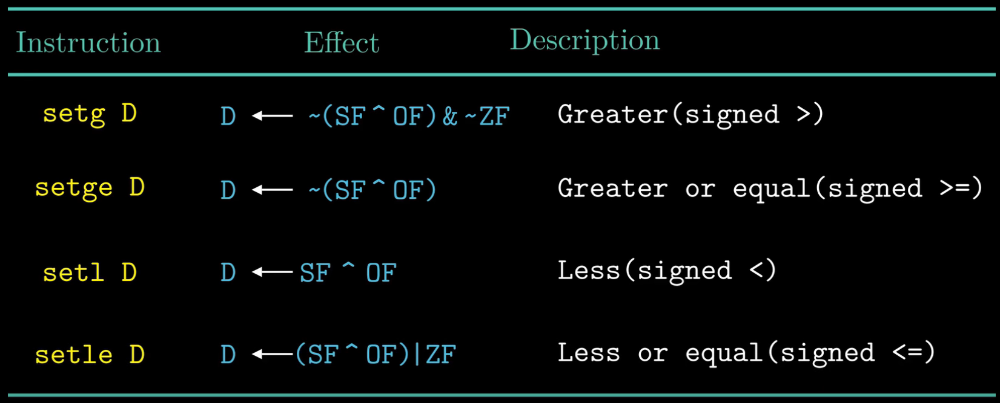

- Several condition code register
  - Carry flag: CF
  - Zero Flag: ZF
  - Sign flag: SF
  - Overflow flag: OF
  

- How the if condition work when condition is equal from assemble instructions level?

- How the if condition work when condition is less from assemble instructions level?
  - it depends on xOr of SF ^ OF

- The set instruction summary for different conditions for signed numbers

- The set instruction summary for different conditions for unsigned numbers

