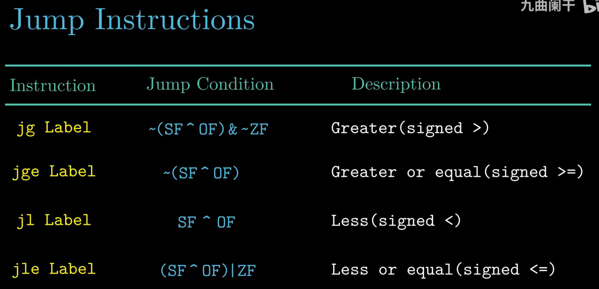
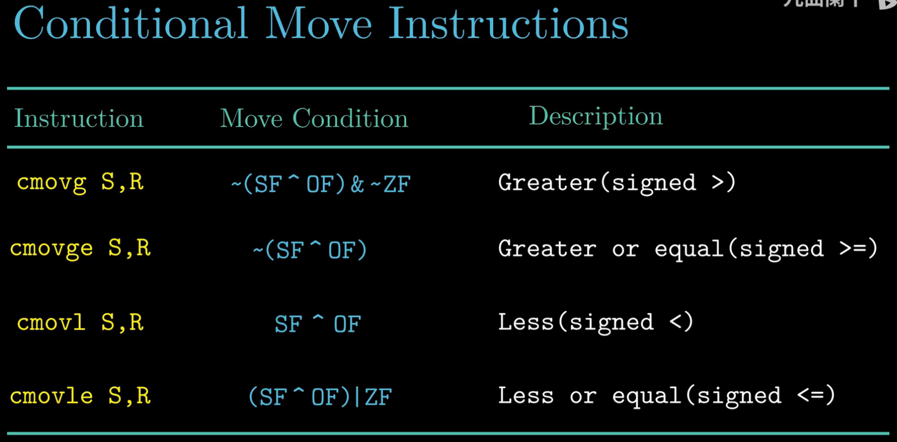
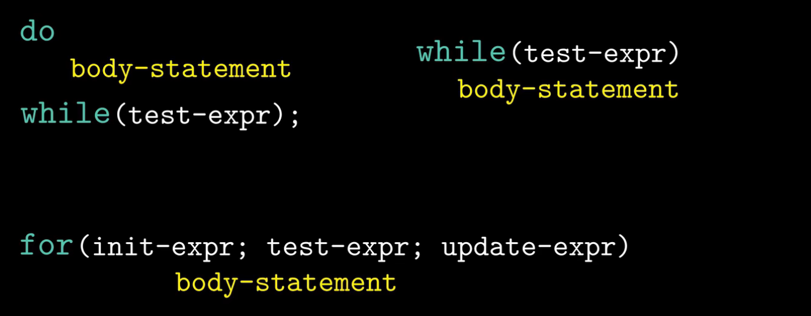
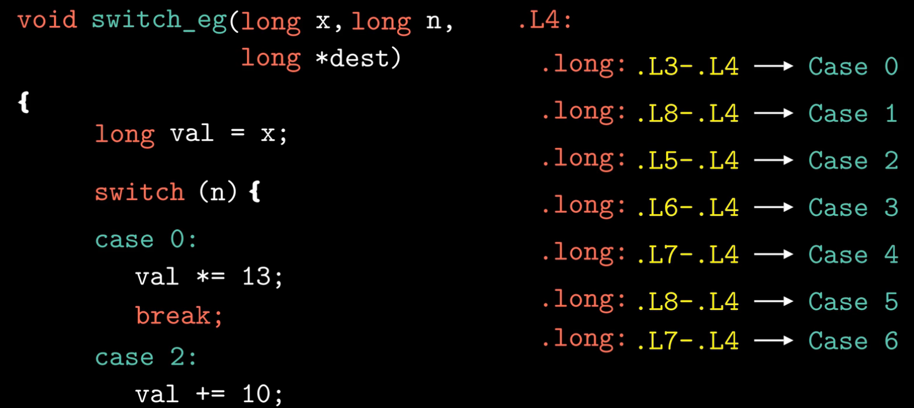

- Why condition move instruction is more efficient than jump instruction?
  - Branch predictor fail may cause memory clean and time consuming. 

- How three types of loop is implemented in C?
  - Combination of conditional test and jump instructions

- Why switch is more efficient than multiple if-else?
  - Since switch time is not related to the number of case.

