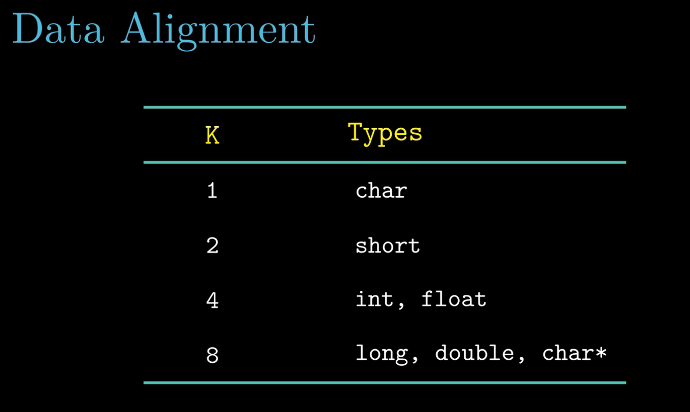
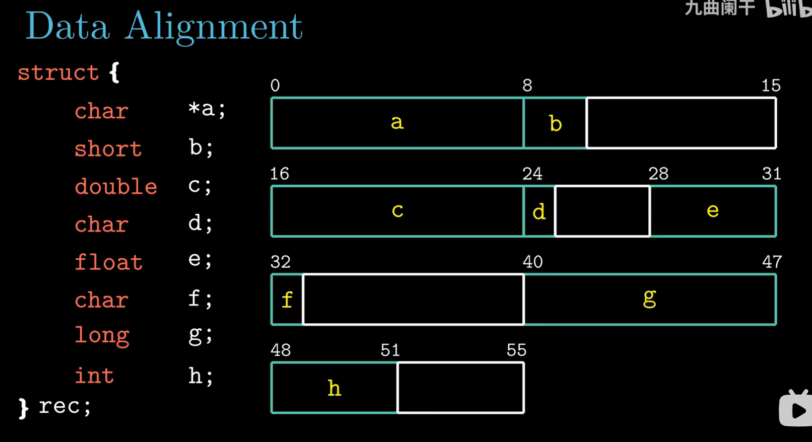
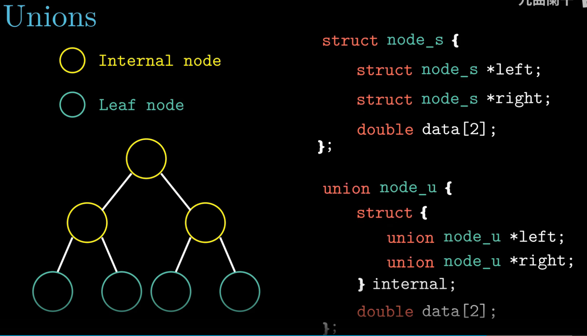
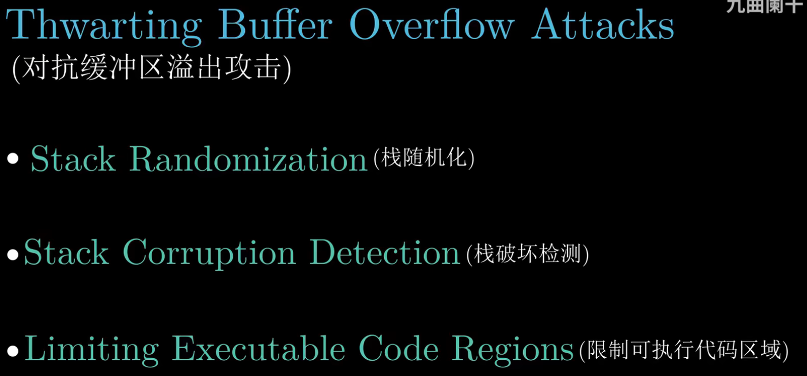

- Struct data alignment

  

- An example for data alignment for struct

  

- Example of union struct to save space

  

- How to resist buffer overflow attack?
  - Stack Randomization
    - Each runtime on different/random addr
  - Stack corruption detection
    - check Canary value is modified or not
  - Limiting executable code regions

  

