- Different instructions with length
  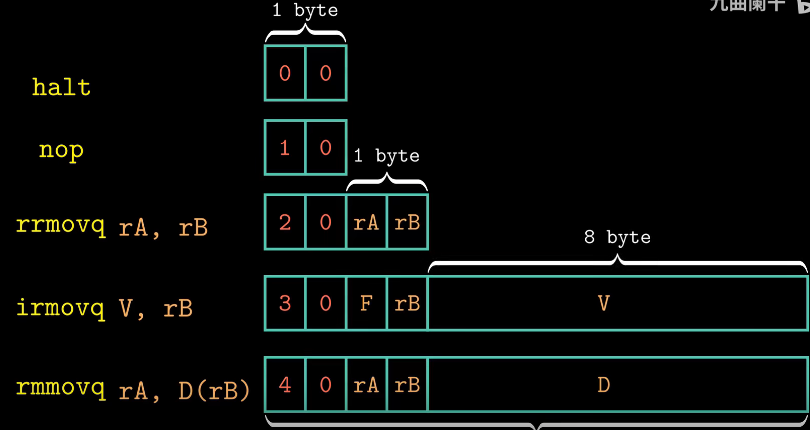

- Six sequential stages of Y86 CPU
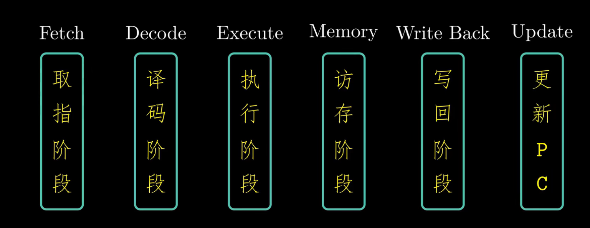

- What's fetch stage?
  - Determine the length of instruction
    - Determine instruction has register input
    - Determine instruction has constant input

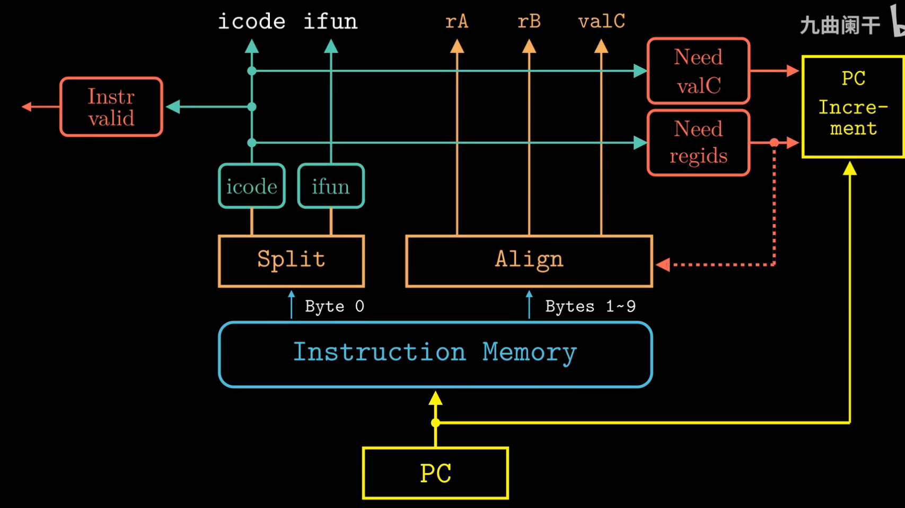

- What's decode stage?
  - Has two reading port
  - Can read two input parallely

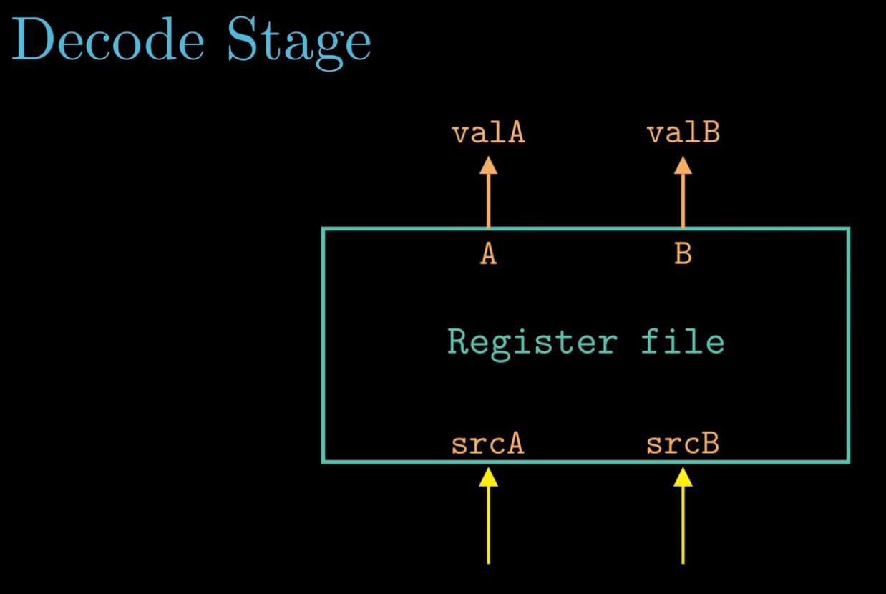

- What's execute stage?
  - Three types of action
    - Logic calculation
    - Compute an effective address
    - `push` and `pop` action

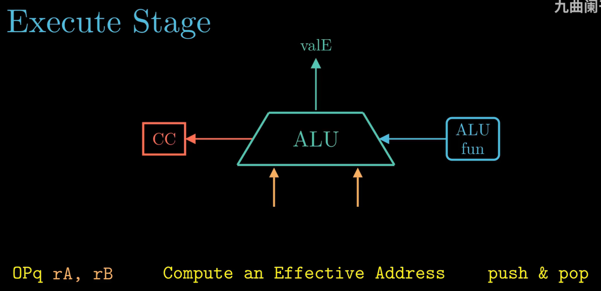

- What's memory stage?
  - Write to memory
  - Read from memory
  
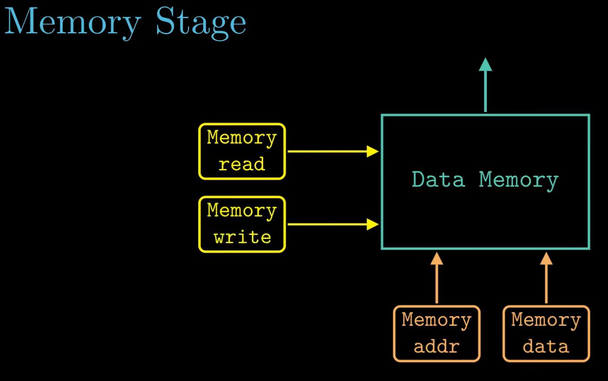

- What's write back stage?
  - Write back to register file
 
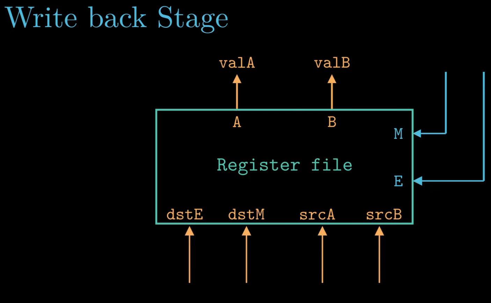

- update PC stage

- An example of what subq instruction is doing
  - Fetch stage
    - Determine `subq` has two registers `%rdx` and `%rbx`
    - Then determine the length of instruction is 2, so `valP = PC + 2`
  - Decode stage
    - Read register value
  - Execute stage
    - output result
    - write CC value
  - Memory stage
    - nothing
  - Write back stage
    - write ALU result back to `%rbx`
  - Update PC
    - `PC = valP`

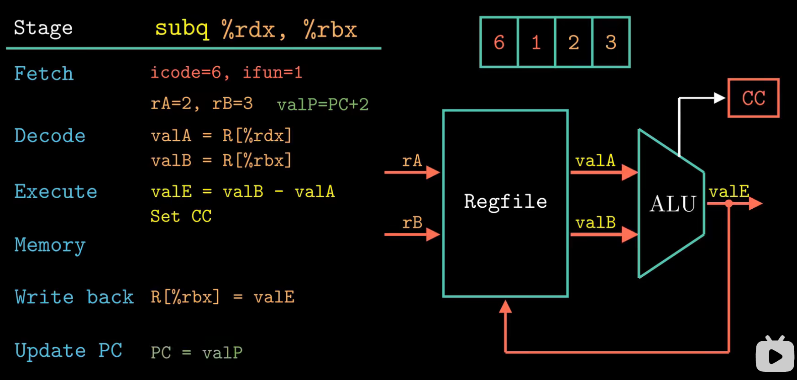

- An example of what data transfer instruction `irmoveq`
  - Fetch stage
    - Determine `irmoveq` has one registers `%rsp`
    - Determine `irmoveq` has one immediate number `8`
    - Then determine the length of instruction is 10, so `valP = PC + 10`
  - Decode stage
    - Don't need to read data from register so do nothing in this stage
  - Execute stage
    - It looks like don't have to do calculation for data transfer
    - Acutally ALU will compute `8 + 0` and write to register
  - Memory stage
    - nothing
  - Write back stage
    - write ALU result back to `%rsp`
  - Update PC
    - `PC = valP`

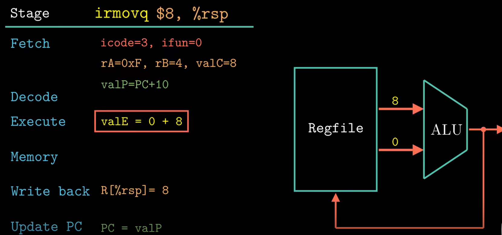

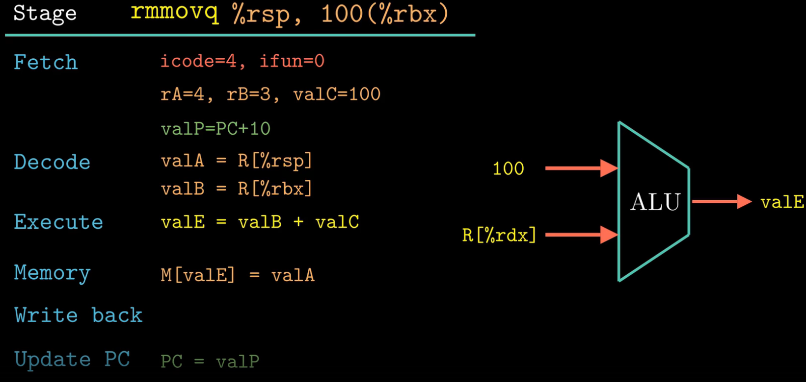

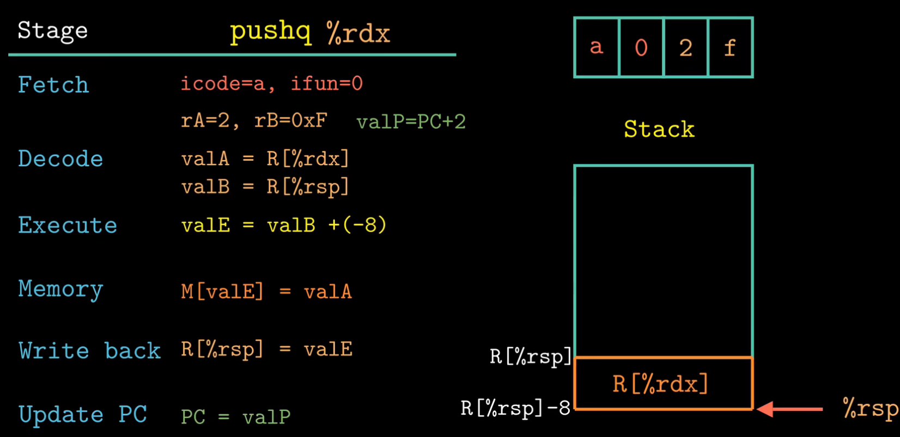

