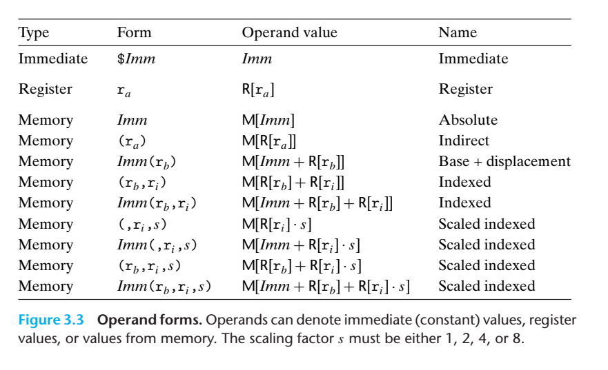

Most instructions have one or more operands specifying the source values to use in performing an operation and the
destination location into which to place the result. x86-64 supports a number of operand forms. Source
values can be given as constants or read from registers or memory. Results can be stored in either registers or memory.
Thus, the different operand possibilities can be classified into three types. The first type, immediate, is for constant
values. In ATTformat assembly code, these are written with a ‘$’ followed by an integer using standard C notation—for
example, $-577 or $0x1F. Different instructions allow different ranges of immediate values; the assembler will
automatically select the most compact way of encoding a value. The second type, register, denotes the contents of a
register, one of the sixteen 8-, 4-, 2-, or 1-byte low-order portions of the registers for operands having 64, 32, 16,
or 8 bits, respectively. 

The third type of operand is a memory reference, in which we access some memory location according to a computed
address, often called the effective address. Since we view the memory as a large array of bytes, we use the notation
Mb[Addr] to denote a reference to the b-byte value stored in memory starting at address Addr. To simplify things, we
will generally drop the subscript b.

There are many different addressing modes allowing different forms of memory references. The most
general form is shown at the bottom of the table with syntax Imm(rb,ri,s). Such a reference has four components: an
immediate offset Imm, a base register rb, an index register ri, and a scale factor s, where s must be 1, 2, 4, or 8.
Both the base and index must be 64-bit registers. The effective address is computed as Imm + R[rb] + R[ri]. s. This
general form is often seen when referencing elements of arrays. The other forms are simply special cases of this general
form where some components are omitted.
