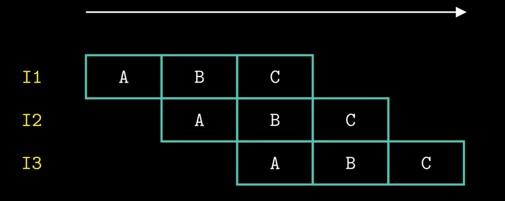
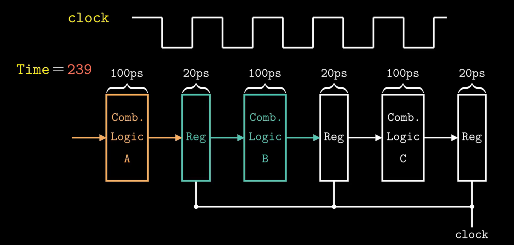
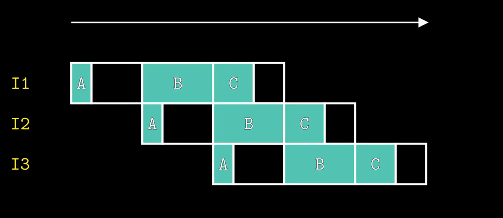
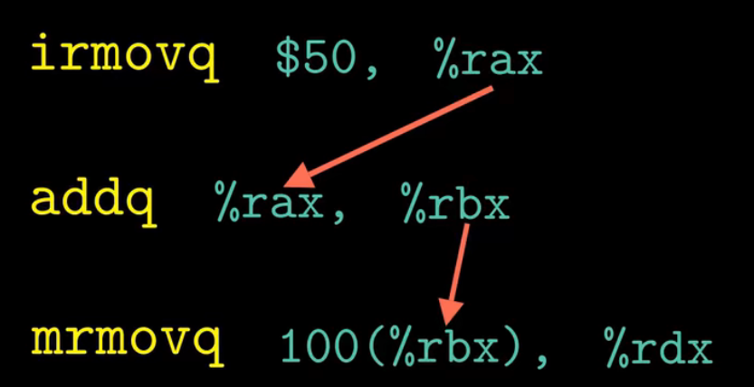
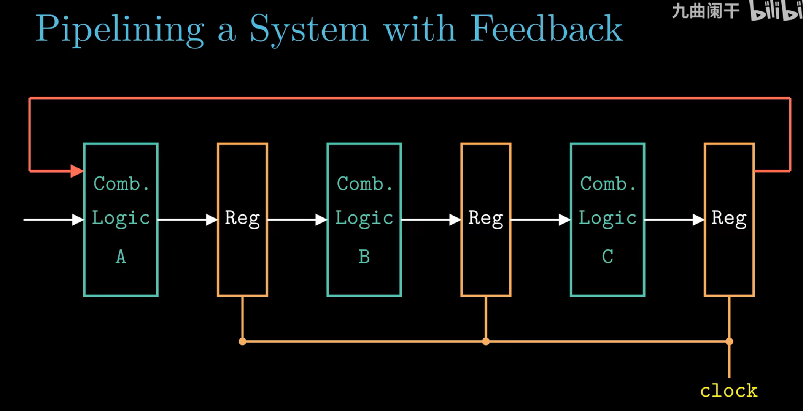

- The basic idea of pipelining

- The details of rising clock

- The actual pipline and why there will be performance drop?
  - Since hard to schedule instructions and make them consume exact same time
  - So there will be idling

- Why can't make pipeline too deep?
  - Data dependency: some instructions need data from previous instruction result
  - Control dependency: some instructions' behavior depends on the if condition.
    - Usually it's implemented by feedback. But it's very dangerous to have feedback machenism in pipeline

