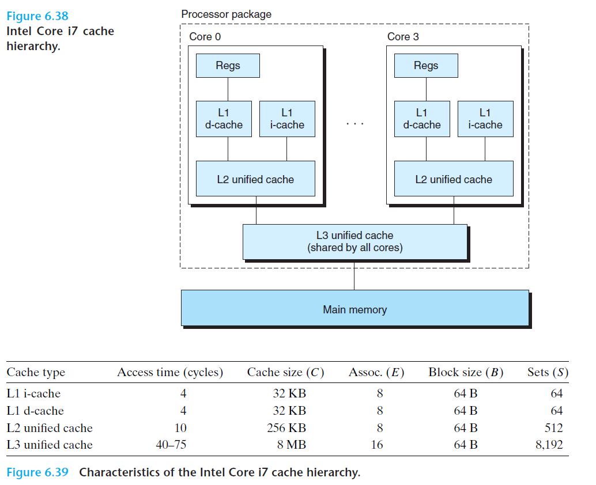

# Ch6 The Memory Hierarchy

## 6.4 Cache Memories

### 6.4.6 Anatomy of a Real Cache Hierarchy

现代多核 CPU 上，每个核心都有自己私有的 L1 i-cache、L1 d-cache 和 L2 cache，所有核心的共享 L3 cache。

* i-cache 和 d-cache 独立开来，使得 CPU 能同时读取一个指令字和数据字。
* 由于 i-cache 是只读的，因此处理简单。故可以针对不同的访问模式来优化这 i-cache 和 d-cache。

### 6.4.7 Performance Impact of Cache Parameters

cache 的性能可以用以下指标来衡量：

* miss rate：不命中率
* hit rate：命中率
* hit time：命中时间
* miss penalty：不命中处罚

影响 cache 效率的因素：

* cache size：较大的 cache size 会提升命中率，但是可能会增加命中时间（行匹配时间增加）
* block size：较大的块能利用好空间局部性以提升命中率，但是块越大意味着 cache line 减少，可能会损害时间局部性，因为块越大，传送时间就越长。
* associativity：较高的相连度可以减少 conflict miss 而导致的抖动，但是较高的相连度可能会增加实现复杂度，例如，行替换带来的复杂性以及不命中处罚。
* write strategy：wrtie-through 易于实现，能使用独立于 cache 的 write buffer 来更新内存；但 wrtie-back 引发的内存传送次数较少，允许更多内存带宽用于执行 DMA 的 I/O 设备。此外，**存储更次越往下层，传送的时间增加，减少传送次数的数量显得更加重要，此时越有可能使用 write back**。

