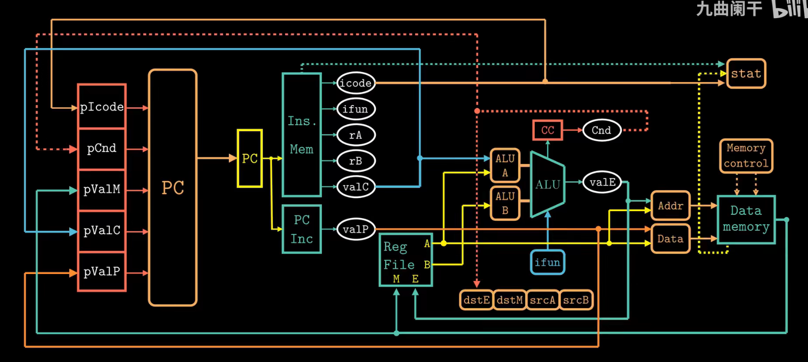
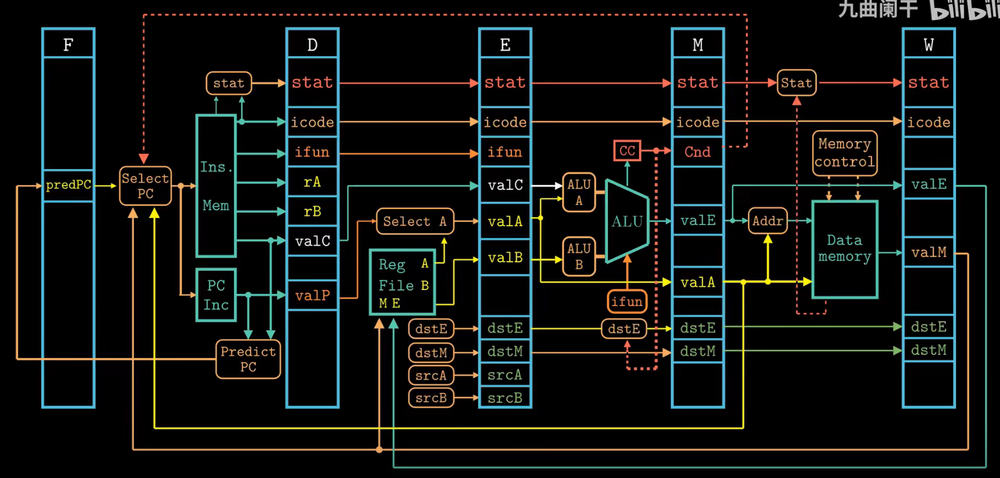
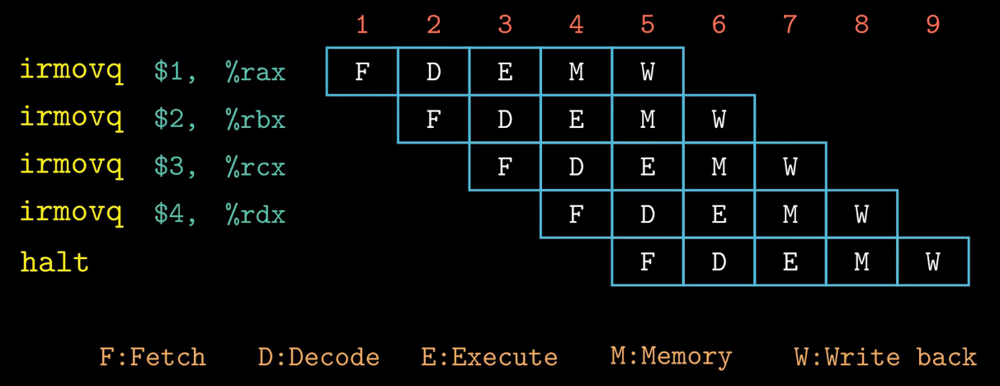
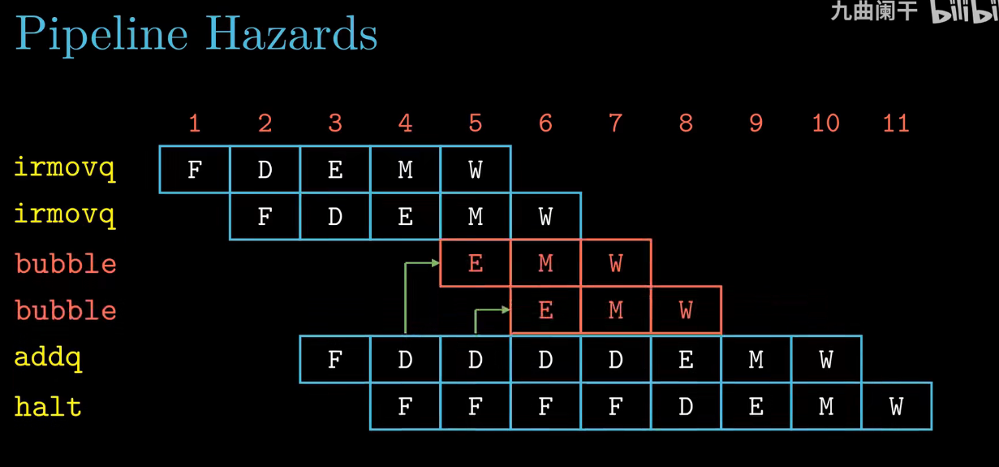

- Why relabeling is necessary?

- Hardware design of pipeline

- When data hazard happens and how it works?
  - Pause with bubble

- Sometimes use forward only can't resolve the issue we need combine Forward with Pause

