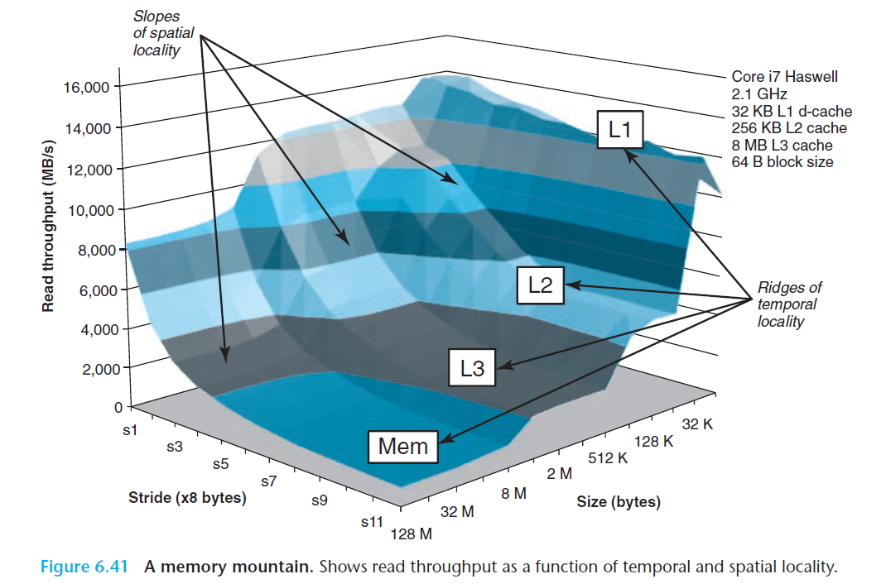

# Ch6 The Memory Hierarchy

## 6.6 Putting It Together: The Impact of Caches on Program Performance

### 6.6.1 The Memory Mountain

程序从存储系统读取数据的速率称为读吞吐量（read throughput）或者读带宽（read bandwidth）。

下图为 Memory Mountain：

* 随着循环访问时步长增加，空间局部性下降。
* 现代 CPU 有预取机制，能自动识别顺序的、步长为 1 的内存访问模式。
* 编写程序时，应该利用时间局部性，使得频繁使用的字从 L1 中取出，同时利用空间局部性，使得尽可能多的字从一个 L1 高速缓存含行中访问。

### 6.6.2 Rearranging Loops to Increase Spatial Locality

提高内循环时间局部性的做法：将程序的数据结构组织成大的片（chunk），让一个片加载到 L1 cache 中，并在该片中进行所有的读和写，处理完毕后，然后再处理下一个片。

### 6.6.3 Exploiting Locality in Your Programs

* 优化程序时，集中关注内循环，因为大部分计算和内存访问集中于内循环；
* 按照访问对象在内存中的顺序，以步长为 1 来读数据，优化空间局部性；
* 读入对象后尽可能多使用，优化时间局部性。

