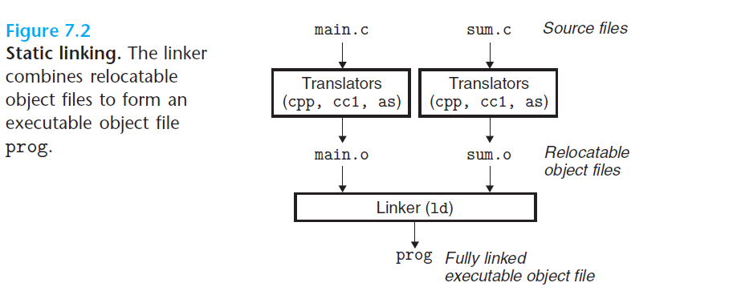

# Ch7 Linking

链接：将各代码和数据片段集合并组合为一个单一文件的过程，可在编译时、加载时或者运行时来完成链接。

早期计算机系统的链接是手动执行的，现代计算机系统中，由链接器（linker）来完成。

使用链接后，程序可以按模块的分离编译，当改变了某模块的一个时，仅需重新编译改动的模块并重新链接，杜绝了全部重新编译其它文件。

## 7.1 Compiler Drivers

程序编译系统由**预处理器**、**编译器**、**汇编器**和**连接器**组成，编译过程如下所示：

## 7.2 Static Linking

链接器完成的任务：

* 符号解析（symbol resolution）：将每个符号引用和符号定义关联起来，其中每个符号对应一个函数、全局变量或静态变量。
* 重定位（relocation）：编译器和汇编器生成从地址 0 开始的代码和数据节。链接器将符号定义和一个内存位置关联起来，重定位这些节，修改所有对符号的引用，使其执行这个内存位置。

链接器并不很了解目标机器的架构，反而编译器和汇编器产生目标文件时和目标机器架构相关性强。

## 7.3 Object Files

目标文件有三种形式：

* 可重定位目标文件：包含二进制代码和数据，其形式可在编译时和其它可重定位文件合并起来，创建为可执行目标文件。
* 可执行目标文件：包含二进制代码和数据，可以直接转入内存执行。
* 共享目标文件：可在加载或运行时被动态载入内存并链接。

