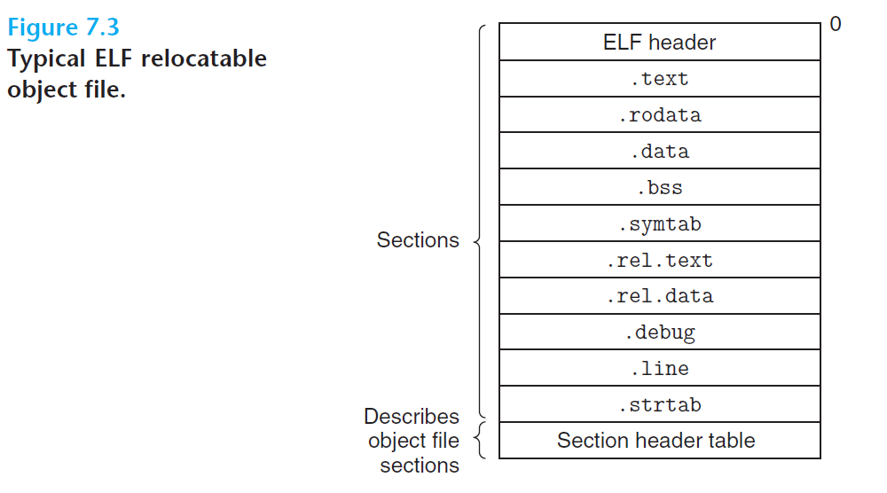

# Ch7 Linking

## 7.4 Relocatable Object Files

下图为常见的 ELF 可重定位目标文件的格式，由以下部分组成：

* ELF header：

    * 头部首先是 16 字节的序列，描述了生成该文件的系统的字长及字节序。

    * 随后包含了帮助链接器语法分析和解释目标文件的信息，有：ELF 头的大小，目标文件类型（可重定位，可执行或共享），机器类型（如 X86-64），section header table 的偏移、section header table 中条目的大小和数量。

        > 不同 section 的位置和大小是由 section header table 描述的

* .text：已编译的机器代码；

* .rodata：程序中只读数据，例如 `printf` 中的格式化字符串；

* .data：已初始化的全局变量和静态变量；

* .bss：未初始化的全局变量和静态变量，以及所有被初始化未 0 的全局或静态变量。这些数据并不在 section 中占据了实际的空间，仅仅是一个占位符，在运行时，会在内存中为这些数据分配内存空间；

* .systab：符号表，存放程序中定义和引用的函数和全局变量的信息；

* .rel.text：一个 .text 中位置的列表，当链接器把这个目标文件和其他文件组合时，需要修改这些位置；

    > 可执行文件中不需要此部分信息，通常被省略

* .rel.data：被模块引用或定义的所有全局变量的重定位信息；

* .debug：调试符号表，其中包含了程序中定义的局部变量和类型定义，程序中定义和引用的全局变量，以及原始的 C 源文件；

    > `-g` 选项才会生成该 section

* .line：原始 C 程序中的行号和 .text 中机器指令的映射

    > `-g` 选项才会生成该 section

* .strtab：字符串表（以 null 结尾的字符串的序列），其中包含了 .symtab 和 .debug 中的符号表，以及节头部中的节名字。

