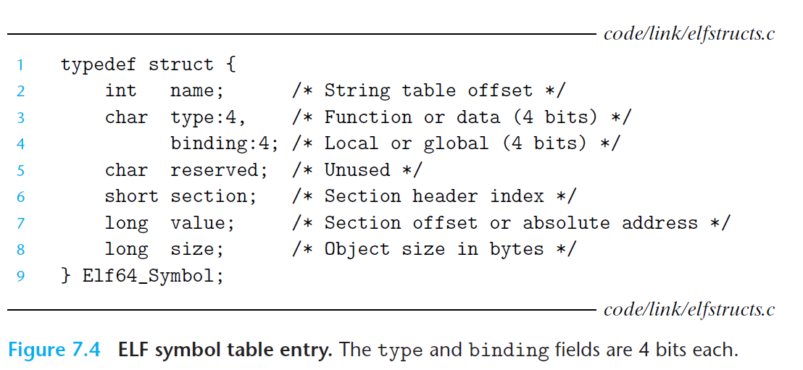

#  Ch7 Linking

## 7.5 Symbols and Symbol Tables

符号表是由汇编器生成的，汇编器使用编译器生成的汇编文件`.s`  文中的符号。`.symtab` 中包括了 ELF 符号表，符号表中包含了一个数组，数组中的每个条目格式如下：

其中：

* name：字符串表中的字节偏移；
* value：对于可重定位的模块来说，value 值是距定义目标的节的起始位置的便宜；对于可执行目标文件来说，该值为一个绝对运行时地址；
* size：目标的大小（以字节为单位）；
* type：符号是 data 还是 function；
* binding：符号是 local 还是 global；

每个符号都会被分配到目标文件中的某个节，由` section `字段表示，该字段是一个到头部表的索引。

有三个特殊的伪节（pseudosection），在头部表中式没有条目的：

* ABS：不该被重定位的符号
* UNDEF：未定义的符号（在本模块中引用，在其他模块中定义）
* COMMON：未被分配存储空间的未初始化的数据目标（value 字段给出了对齐要求，size 字段给出了最小的大小）

> 注意：仅重定位文件才存在这些伪节，可执行目标文件中是不存在的

`.bss` 和 COMMON 的区别细微，现代 GCC 依据一下规则将可重定位目标文件的符号分配到 COMMON 和 `.bss` 中：

* COMMON：未初始化的全局变量
* `.bss`：未初始化的静态变量，初始化为 0 的全局或静态变量

使用 readelf 可以查看目标文件内容