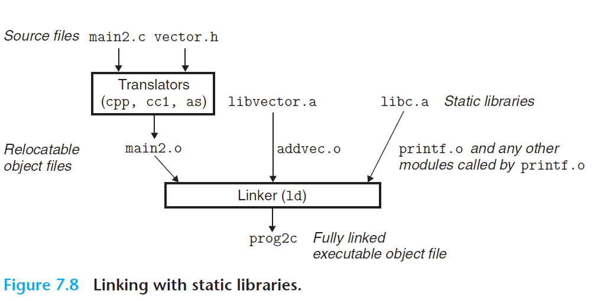

#  Ch7 Linking

## 7.6 Symbol Resolution

### 7.6.2 Linking with Static Libraries

静态库可以用于解决上述方法的缺点，相应的函数编译为独立的模块后，可以封装为一个单独的静态库文件。在进行链接时，链接器仅复制被程序应用的目标模块，这样减少了可执行文件的磁盘和内存占用。

> 在 Linux 系统中，静态库以 archive 的文件格式（文件后缀为 `.a`）存放于磁盘中，该文件是一组连接起来的可重定位目标文件的集合，有一个头部文件用于描述各成员目标文件的大小和位置。

静态链接库的流程如下图：

> 使用 `gcc -static -o prog2c main2.o ./libvector.a` 或 `gcc -static -o prog2c main2.o -L. -lvector`

### 7.6.3 How Linkers Use Static Libraries to Resolve References

Linux 在链接时的符号解析阶段，会按照编译命令中的参数从左到右的顺序来扫描可重定位目标文件和存档文件。但是，这种做法可能会导致链接时错误，因为命令行中的库和目标文件的顺序出现问题时，可能会导致引用无法解析。

命令行中静态库的规则如下：

* 一般位于命令行的末尾；
* 如果各个库之间的成员是相互独立的（即不存在成员引用），那么在结尾处可以以任意顺序放置任何库；
* 如果库之间不是相互独立的，则必须对库的放置顺序按照依赖关系进行排序。

