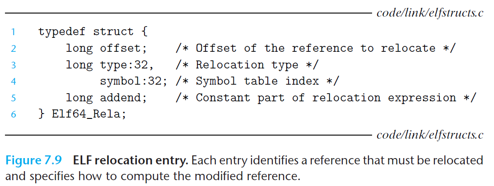

#  Ch7 Linking

## 7.7 Relocation

链接器完成符号解析将引用和符号定义关联起来后，开始重定位步骤，在该步骤中将合并多个输入模块，为每个符号分配运行时的地址。重定位由以下两步组成：

1. Relocating sections and symbol definitions.

    将所有可重定位文件的相同类型的 section 合并成同一类型的新的 section，链接器将运行时内存地址赋给新的 section 和 所有符号。经过这一步，程序中的每条指令和全局变量都有唯一的运行时内存地址。

2. Relocating symbol references within sections.

    链接器修改 code section 和 data section 中的符号引用，使其指向正确的运行时地址。修改的过程中，链接器依赖于 relocation entry。

### 7.7.1 Relocation Entries

汇编器遇到最终位置不确定的目标引用时，其会生成一个 relocation entry ，告知链接器在将目标文件合并成可执行文件时该如何修改引用。

> 其中，代码的  relocation entry  位于目标文件中的 `.rel.text` 中，已初始化的数据的  relocation entry 位于 `.rel.data` 中。

下图为 ELF  relocation entry 的格式，其中：

* `offset`：需要被修改的引用的 section offset；
* `symbol`：被修改引用需要指向的符号；
* `type`：链接器如何修改新的引用；
* `addend`：有符号常数，某些特定类型的重定位需要使用该常数对修改引用的值进行偏移调整。

ELF 定义了 32 种的可重定位类型，其中：

* `R_X86_64_PC32`：重定位一个使用 32 位 PC 相对地址的引用（相对地址指的是当前指令距离 PC 寄存器当前运行值得偏移量）。
* `R_X86_64_32`：重定位一个使用 32 位绝对地址的引用。

> 以上两种重定位类型支持 x86-64 小型代码模型（small code model），该类模型假定可执行目标文件中体积小于 2GB ，能使用 32 位 PC 相对地址进行访问。
>
> GCC 默认使用小型代码模型，可通过开启 `-mcmodel=medium` 和 `-mcmodel=large` 分别开启中型代码模型和大型代码模型。

