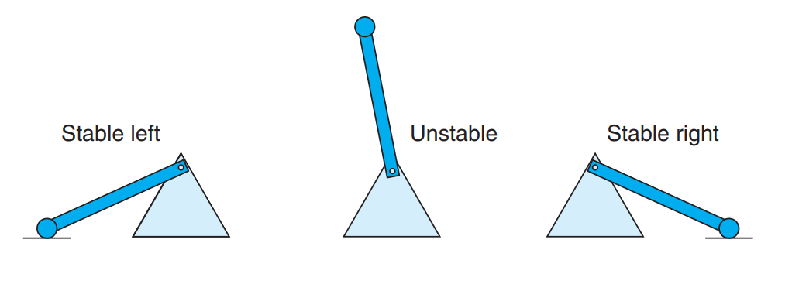

## Chapter 6

### 6.1 Storage Technologie

#### 6.1.1 Random Access Memory

Random access memory (RAM) comes in two varieties—static and dynamic. Static
RAM (SRAM) is faster and significantly more expensive than dynamic RAM
(DRAM). SRAM is used for cache memories, both on and off the CPU chip.
DRAM is used for the main memory plus the frame buffer of a graphics system.
Typically, a desktop system will have no more than a few tens of megabytes of
SRAM, but hundreds or thousands of megabytes of DRAM

- Static RAM

  SRAM stores each bit in a bistable memory cell. Each cell is implemented with
a six-transistor circuit. This circuit has the property that it can stay indefinitely
in either of two different voltage configurations, or states. Any other state will
be unstable—starting from there, the circuit will quickly move toward one of the
stable states. Such a memory cell is analogous to the inverted pendulum illustrated
in Figure 6.1.

  

- Dynamic RAM

  DRAM stores each bit as charge on a capacitor. This capacitor is very small—
  typically around 30 femtofarads—that is, $30 \times 10^{−15}$ farads. Recall, however, that
  a farad is a very large unit of measure. DRAM storage can be made very dense—
  each cell consists of a capacitor and a single access transistor. Unlike SRAM,
  however, a DRAM memory cell is very sensitive to any disturbance. When the
  capacitor voltage is disturbed, it will never recover. Exposure to light rays will
  cause the capacitor voltages to change. In fact, the sensors in digital cameras and
  camcorders are essentially arrays of DRAM cells.