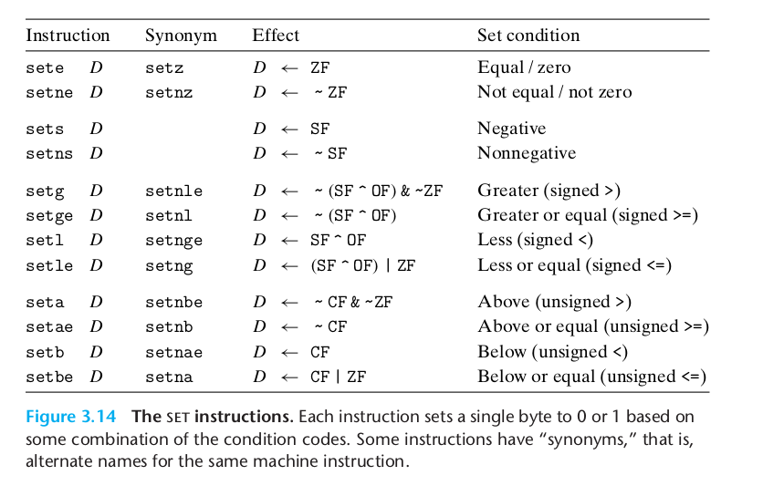

# Accessing the Condition Codes

Rather than reading the condition codes directly, there are three common ways of using the condition codes: (1) we can
set a single byte to 0 or 1 depending on some combination of the condition codes, (2) we can conditionally jump to some
other part of the program, or (3) we can conditionally transfer data. For the first case, the instructions described in
Figure 3.14 set a single byte to 0 or to 1 depending on some combination of the condition codes. We refer to this entire
class of instructions as the set instructions; they differ from one another based on which combinations of condition
codes they consider, as indicated by the different suffixes for the instruction names. It is important to recognize that
the suffixes for these instructions denote different conditions and not different operand sizes. For example,
instructions setl and setb denote “set less” and “set below,” not “set long word” or “set byte.”

A set instruction has either one of the low-order single-byte register elements
(Figure 3.2) or a single-byte memory location as its destination, setting this byte to either 0 or 1. To generate a
32-bit or 64-bit result, we must also clear the high-order bits. A typical instruction sequence to compute the C
expression a < b, where a and b are both of type long, proceeds as follows:
