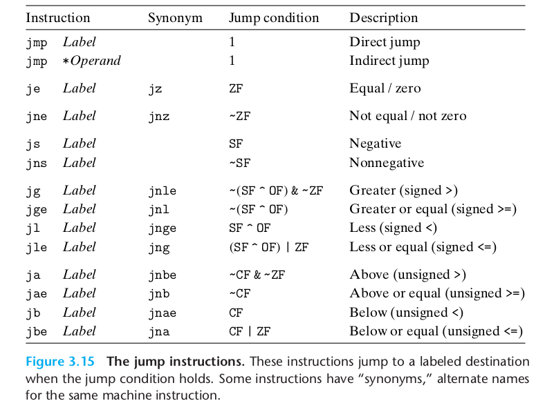

The instruction jmp .L1 will cause the program to skip over the movq instruc- tion and instead resume execution with the
popq instruction. In generating the object-code file, the assembler determines the addresses of all labeled instruc-
tions and encodes the jump targets (the addresses of the destination instructions)
as part of the jump instructions. Figure 3.15 shows the different jump instructions. The jmp instruction jumps
unconditionally. It can be either a direct jump, where the jump target is encoded as part of the instruction, or an
indirect jump, where the jump target is read from a register or a memory location. Direct jumps are written in assembly
code by giving a label as the jump target, for example, the label .L1 in the code shown. Indirect jumps are written
using ‘*’ followed by an operand specifier using one of the memory operand formats described in Figure 3.3. As examples,
the instruction

```asm
jmp *%rax
```

uses the value in register %rax as the jump target, and the instruction

```asm
jmp *(%rax)
```

reads the jump target from memory, using the value in %rax as the read address. The remaining jump instructions in the
table are conditional—they either jump or continue executing at the next instruction in the code sequence, depending on
some combination of the condition codes. The names of these instructionsSection 3.6 and the conditions under which they
jump match those of the set instructions. As with the set instructions, some of the underlying machine instructions
have multiple names. Conditional jumps can only be direct.
