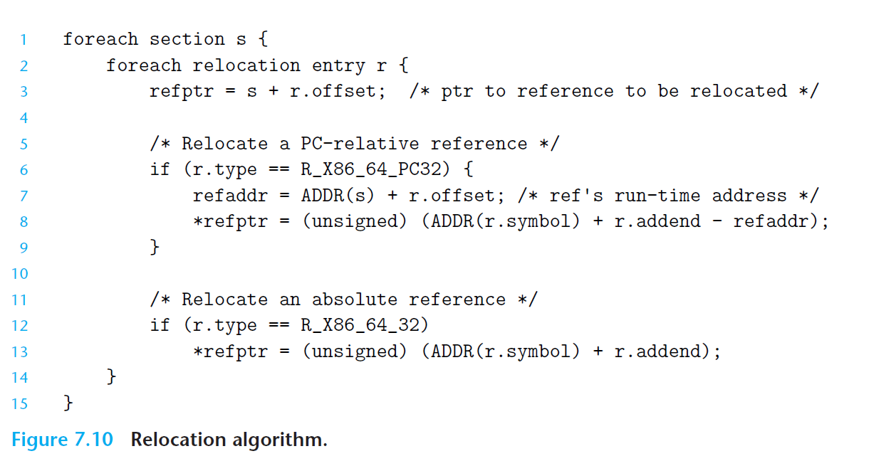
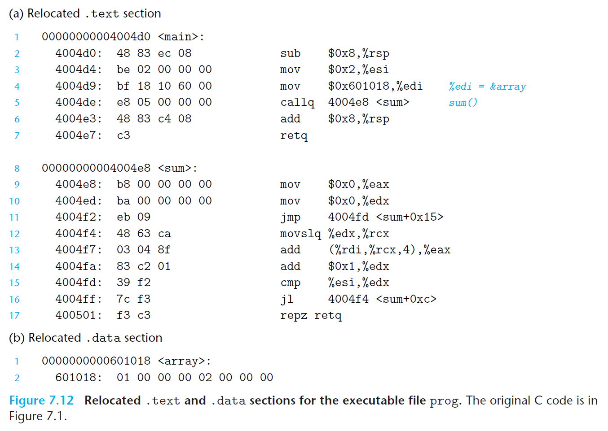

#  Ch7 Linking

## 7.7 Relocation

### 7.7.2 Relocating Symbol References

链接器重定位算法的伪代码如下图所示，其中：

* `s` 为可重定位目标代码中某 section 的地址，运行时地址为 `ADDR(s)`
* `r` 为 section 中的 relocation entry，运行时地址为 `ADDR(r.symbol)`

如下图中的目标码中，有两个需要重定位的符号引用，会根据以上算法，分别进行重定位相对引用和绝对引用。

最终重定位的 `.text` 和  `.data` 如下图，最终程序载入内存时，直接将其复制这些 section 中的字节到内存即可，不需要进行其它修改。

