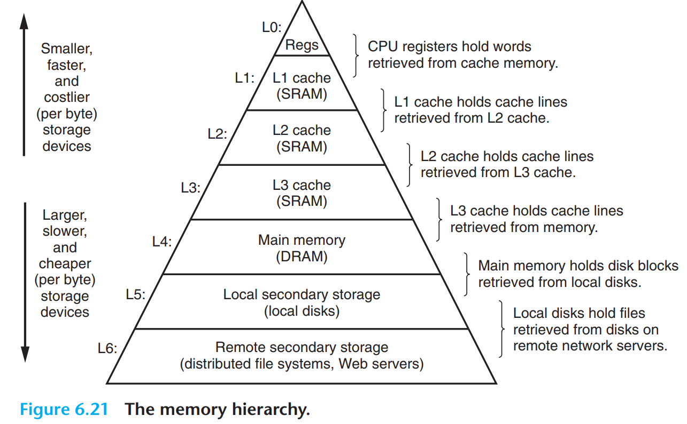

## Chapter 6

### 6.1 Memory Hierarchy

In general, the storage devices get slower, cheaper, and larger as we move
from higher to lower levels. At the highest level (L0) are a small number of fast
CPU registers that the CPU can access in a single clock cycle. Next are one or
more small to moderate-size SRAM-based cache memories that can be accessed
in a few CPU clock cycles. These are followed by a large DRAM-based main
memory that can be accessed in tens to hundreds of clock cycles. Next are slow
but enormous local disks. Finally, some systems even include an additional level
of disks on remote servers that can be accessed over a network. For example,
distributed file systems such as the Andrew File System (AFS) or the Network
File System (NFS) allow a program to access files that are stored on remote
network-connected servers. Similarly, the World Wide Web allows programs to
access remote files stored on Web servers anywhere in the world.

  
