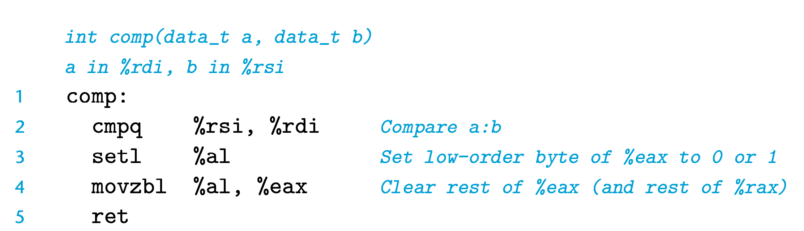

Note the comparison order of the cmpq instruction (line 2). Although the arguments are listed in the order %rsi (b), then %rdi (a), the comparison is really between a and b. Recall also, as discussed in Section 3.4.2, that the movzbl instruction (line 4) clears not just the high-order 3 bytes of %eax, but the upper 4 bytes of the entire register, %rax, as well.

For some of the underlying machine instructions, there are multiple possible names, which we list as “synonyms.” For example, both setg (for “set greater”) and setnle (for “set not less or equal”) refer to the same machine instruction. Compilers and disassemblers make arbitrary choices of which names to use.

Although all arithmetic and logical operations set the condition codes, the de- scriptions of the different set instructions apply to the case where a comparison instruction has been executed, setting the condition codes according to the com- putation t = a-b. More specifically, let a, b, and t be the integers represented in two’s-complement form by variables a, b, and t, respectively, and so t = a -tw b, where w depends on the sizes associated with a and b.

