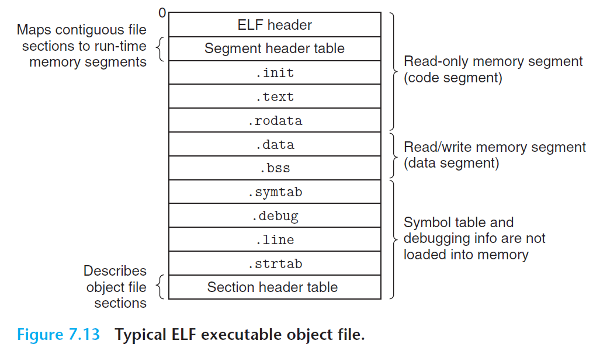
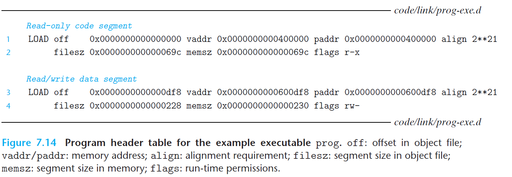

#  Ch7 Linking

## 7.8 Executable Object Files

ELF 可执行目标文件的各类信息如下图所示：

可执行目标文件的格式类似于可重定位目标文件的格式，其包括了：

* 程序的入口点，即程序要执行的第一条执行的地址；
* 经过重定位的 `.text`、`.rodata`、`.data` 段；
* `.init` 定义了一个名为 `_init ` 的小函数，程序的初始化代码会调用该函数。

> 由于重定位已经完成，所有可执行目标文件不需要 `rel` 段。

ELF 可执行目标文件易于加载到内存，其连续的片会被映射到连续的内存段。program header table 描述了这种映射关系，下图为一个 program header table  的信息，其中：

* `vaddr mod align = off mod align` 要求了 section 之前对齐，目的是为了目标文件中的段能够有效率的被传送到内存中。

