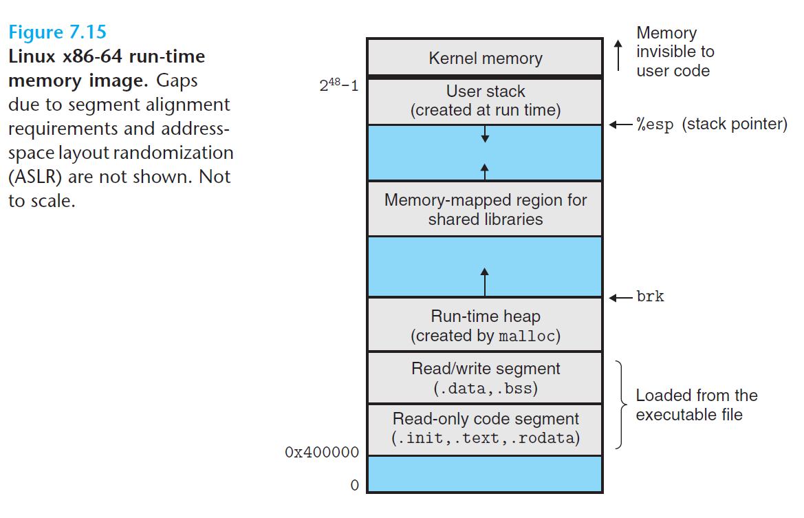

#  Ch7 Linking

## 7.9 Loading Executable Object Files

从 shell 中运行一个程序时，shell 回通过驻留在内存中的 loader 的操作系统代码来运行该程序，loader 将可执行目标文件的代码和数据从磁盘复制到内存中，然后跳转到程序入口来执行该程序，该过程成为加载。

程序在内存中的运行时表示如下图，其中：

* 代码段从 `0x400000` 地址处开始，其后是数据段；
* 数据段后是运行时堆，其通过调用 `malloc` 库向上增长；
* 堆后的区域是共享模块保留的；
* 用户栈从最大的合法用户地址`2^48 - 1` 地址开始，向内存低地址增长；
* 用户栈起始地址向上，即 `2^48` 地址，是为内核中的代码和数据保留的，即操作系统常驻在内存中的部分。

下图中的各段之间彼此相邻，但是由于 `.data` 段有对齐要求，因此 `.text` 段 和 `.code` 段之间是会存在一定间隙的。此外，由于链接器使用`地址空间布局随机化`技术，在分配栈、共享库和堆运行时地址的时候，每次程序运行时这些区域的地址会发生变化，但其相对地址不会变化。

当加载器运行时，会创建上图中的内存映像，其步骤如下：

1. 在 `segment header table` 的引导下，加载器将可执行文件的片复制到代码段和数据段（该阶段会发生虚拟地址空间到物理地址空间的转换）；
2. 然后跳转至程序的入口点，即 `_start` 函数的地址，该函数在系统目标文件 `ctrl.o` 中定义；
3. `_start` 函数调用系统启动函数 `__libc_start_main` ，该函数定义在 `libc.so` 中，其会初始化执行环境，调用用户层的`main`函数，处理`main`函数的返回值，并在需要的时候将程序的控制权交给内核。