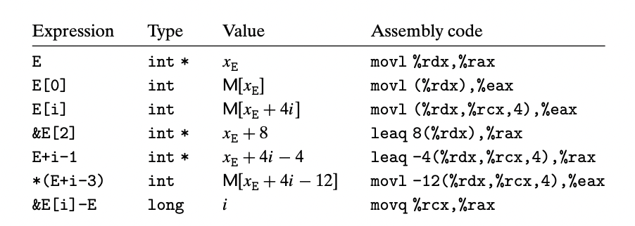

The unary operators ‘&’ and ‘*’ allow the generation and dereferencing of pointers. That is, for an expression *Expr* denoting some object, &*Expr* is a pointer giving the address of the object. For an expression *AExpr* denoting an address, **AExpr* gives the value at that address. The expressions *Expr* and *&*Expr* are therefore equivalent. The array subscripting operation can be applied to both arrays and pointers. The array reference A[i] is identical to the expression *(A+i). It computes the address of the ith array element and then accesses this memory location.

Expanding on our earlier example, suppose the starting address of integer array E and integer index i are stored in registers %rdx and %rcx, respectively. The following are some expressions involving E. We also show an assembly-code implementation of each expression, with the result being stored in either register %eax (for data) or register %rax (for pointers).

