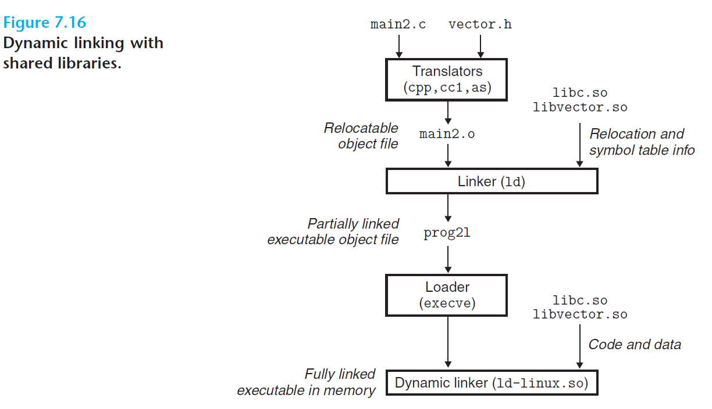

#  Ch7 Linking

## 7.10 Loading Executable Object Files

静态库的缺点：

* 需要定期维护更新，后续发布时需要显示的重新链接
* 某些特定的函数（例如，C 程序中的标准 I/O 函数），如果使用静态链接会导致内存资源浪费较大

共享库用于解决上述问题。共享库时一个目标模块，在运行或加载时，可以加载到任意的内存地址，并和一个在内存中的程序链接起来，这个过程为动态链接（dynamic linking），由动态链接器（dynamic linker）的程序来执行。

共享库有两种方式来完成共享：

* 所有引用到某个共享库的可执行目标文件共享
* 在内存中，一个共享库的 `.text` 的一个副本可以不同的正在运行的进程共享

动态链接的过程如下图所示：

1. `gcc -shared -fpic -o libvector.so addvec.c multvec.c` 生成动态链接库 `libvector.so`
    * `-fpic` 指示编译器生成与位置无关的代码
    * `-shared` 指示链接器创建一个共享的目标文件
2. `gcc -o prog21 main2.c ./libvector.so` 将动态链接库连接到程序中，生成的可执行目标文件可以在运行时和 `libvector.so` 进行链接。
    * 此过程中 `libvector.so` 的 `.code` 和 `.data` 段并不会复制到可执行文件中，而是会复制一些重定位和符号表信息，使起运行时能解析相关代码和数据的引用。
3. 当运行可执行目标文件时，加载到内存中后，其包含一个  `.interp` 段，该段中包含了动态链接器的路径名（该动态链接器本身就是一个共享目标，例如 Linux 中的 `ld-linux.so`），加载器会加载和运行该动态链接器，然后执行下列命令完成重定位链接任务：
    * 重定位`libc.so` 、`libvector.so` 的文本和数据到两个分开的内存段；
    * 重定位 `prog21` 中所有对 `libc.so` 和 `libvector.so` 中所定义符号的引用。
4. 最后，动态链接器讲控制权交由程序，共享库的位置固定了且在执行过程中不会改变。

