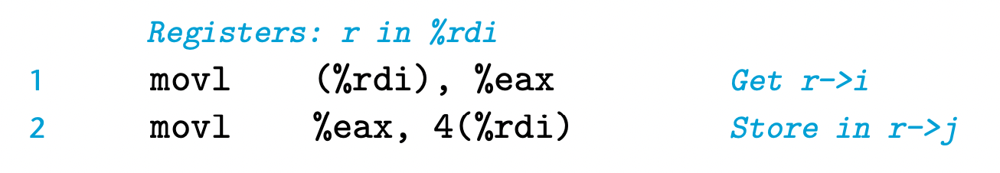
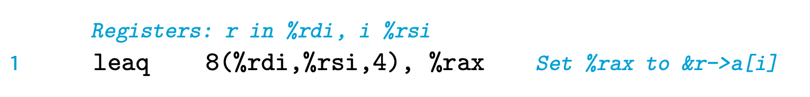
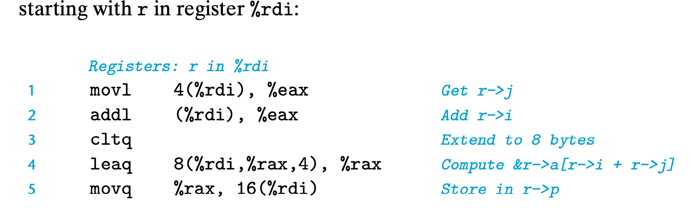

# Structure

The C struct declaration creates a data type that groups objects of possibly different types into a single object. The different components of a structure are referenced by names. The implementation of structures is similar to that of arrays in that all of the components of a structure are stored in a contiguous region of memory and a pointer to a structure is the address of its first byte. The compiler maintains information about each structure type indicating the byte offset of each field. It generates references to structure elements using these offsets as displacements in memory referencing instructions.


As an example, consider the following structure declaration:

```c
struct rec {
    int i;
    int j;
    int a[2];
    int *p;
};
```

This structure contains four fields: two 4-byte values of type int, a two-element

array of type int, and an 8-byte integer pointer, giving a total of 24 bytes:


Observe that array a is embedded within the structure. The numbers along the top of the diagram give the byte offsets of the fields from the beginning of the structure.

To access the fields of a structure, the compiler generates code that adds the appropriate offset to the address of the structure. For example, suppose variable r of type struct rec * is in register %rdi. Then the following code copies element r->i to element r->j:



To generate a pointer to an object within a structure, we can simply add the field’s offset to the structure address. For example, we can generate the pointer &(r->a[1]) by adding offset 8 + 4 . 1 = 12. For pointer r in register %rdi and long integer variable i in register %rsi, we can generate the pointer value &(r->a[i]) with the single instruction



As a final example, the following code implements the statement

```c
r->p = &r->a[r->i + r->j];
```

starting with r in register %rdi:


