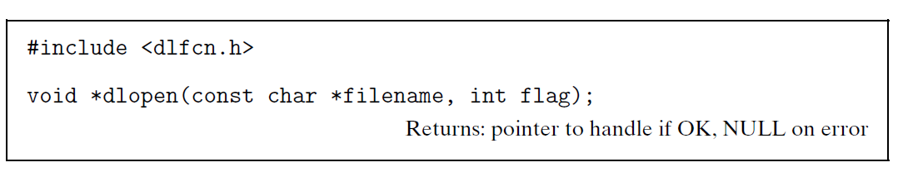
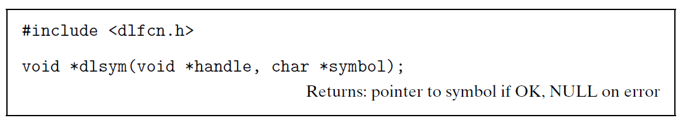
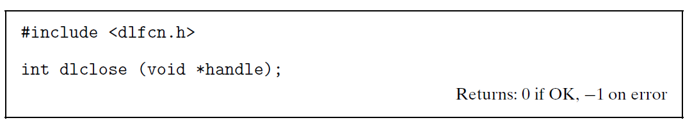
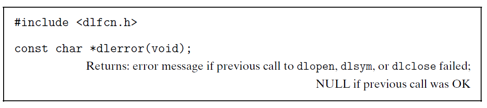
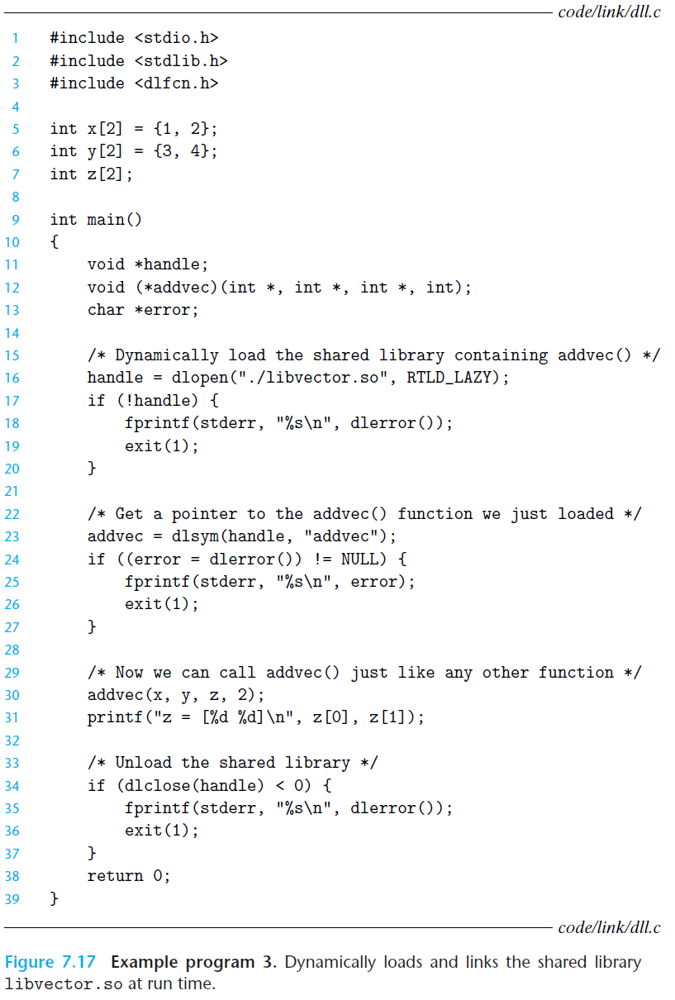

#  Ch7 Linking

## 7.11 Loading Executable Object Files

动态链接器允许在程序运行时在加载和链接共享库，接口如下：

* `dlopen` 函数加载和链接共享库 filename，

    * The external symbols in filename are resolved using libraries previously opened with the `RTLD_GLOBAL` flag.
    * 如果当前可执行目标文件带  `-rdynamic`编译选项，那么其符号解析式来说，其符号式全局可用的；
    * flag 参数中必须包括 `RTLD_NOW` 或者 `RTLD_LAZY` (二选一)：
        * `RTLD_NOW` ：指示链接器立即解析对外部符号的引用；
        * `RTLD_LAZY`：指示链接器推迟符号解析，到执行改代码时再解析。 

    

* `dlsym` 函数的参数是：一个之前已经打开了的共享库的句柄和一个 symbol 名字，如果该符号存在，则返回符号地址，否则返回 NULL。

    

* `dlclose`函数会在该共享库不存在被其它库使用时，卸载该共享库。

    

* `dlerror` 函数返回上述三个函数最近发生的错误。

    

共享库使用步骤，如下代码，编译选项：`gcc -rdynamic -o prog2r dll.c -ldl`

