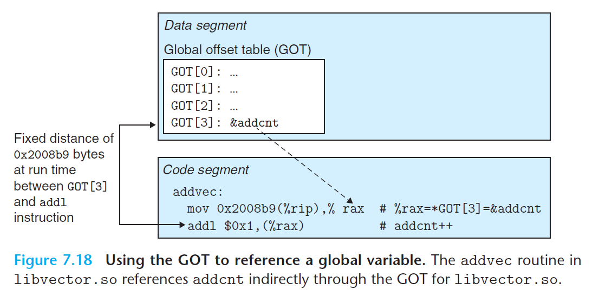

# Ch7 Linking

## 7.12 Position-Independent Code (PIC)

现代系统使用 PIC 方式编译共享模块的代码段，使得可以把它们加载到内存的任何位置而无需链接器修改，使得多个进程能共享一个共享模块的代码段的单一副本。

可以加载而无需重定位的代码成为位置无关代码（Position-Independent Code， PIC），使用 GCC 编译时必须使用 `-fpic` 选项来指示编译器生成 PIC 代码，共享库的编译必须总是使用该选项。

在 X86-64 系统中，对同一目标模块中的符号引用时不需要处理成 PIC 的，其可以直接使用 PC 相对寻址来编译这些引用，构造目标文件时由静态链接器重定位。对共享模块的定义的外部函数和对全局变量的引用需要特殊处理。

### PIC Data References

Fact：代码段中的任何指令和数据段中的任何变量的距离都是一个运行时产量，与其加载到内存中的绝对地址时无关的。

基于此事实，生成全局变量 PIC 引用的编译器会在数据段开始的时候创建**全局偏移量表（Global Offset Table，GOT）**，该表中有一个 8 字节的条目，条目中所存储的内容是被这个目标模块所引用的全局数据目标（函数或全局变量）。此外，**编译器还会为 GOT 中的每个条目生成一个重定位记录，加载时由动态链接器重定位 GOT 中的每个条目，得到包含目标的绝对位置。** 

每个引用全局目标的目标模块都由自己的 GOT。

下图为 `libvector.so` 共享模块中的 GOT，addvec 函数通过 GOT 条目动态加载全局变量 `addcnt` 的地址，然后进行其它操作。

