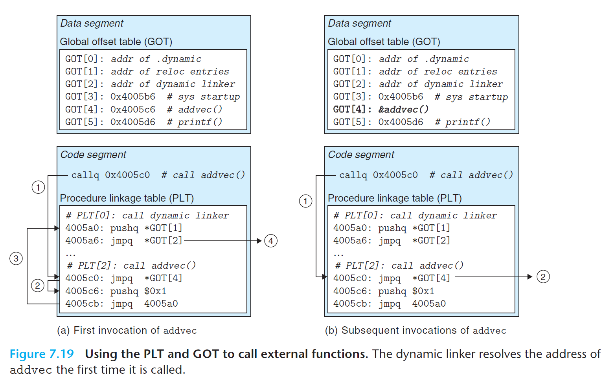

# Ch7 Linking

## 7.12 Position-Independent Code (PIC)

### PIC Function Calls

对于共享库中的函数，编译器可能无法其运行时地址，因为定义该函数的共享模块可以在运行时加载到任何位置。GNU 编译系统使用延迟绑定（lazy binding）见函数地址的绑定推迟到第一次调用时。

延迟绑定的好处：如果像 `libc.so` 这种包含了大量函数的共享库，某些程序代码可能使用一部分函数，但是仅需要重定位这部分函数而不需要重定位该共享库中的所有函数。延迟绑定第一次调用函数时的运行时开销较大，当后续的每次调用只需要花费一条指令和一个间接的内存引用。

使用延迟绑定的需要使用 GOT （Global Offset Table）和 过程链接表（Procedure Linkage Table，PLT）。如果某个目标模块调用定义了共享库中的任何函数，那么该模块会存在自己的 GOT 和 PLT，分别位于数据段和代码段中。

PLT 数组中存储了 16 字节代码的条目，其中，

* PLT[0] 为特殊条目，跳转到动态链接器中。
* 每个被可执行程序调用的库函数都有自己的 PLT 条目，每个条目负责调用一个具体的函数。
* PLT[1] 调用系统启动函数（`__libc_start_main`），其负责初始化环境，调用 main 函数并处理返回值。
* PLT[2] 往后的条目调用用户代码所调用的函数。

如下图所示，GOT 表和 PLT  联合使用时，GOT[0] 和 GOT[1] 包含动态链接器在解析函数地址时会使用的信息，GOT[2] 是动态链接器在 `ld-linux.so` 模块中的入口点。其余条目都对应了一个被调用的函数，这些函数的地址将在运行时被解析。

