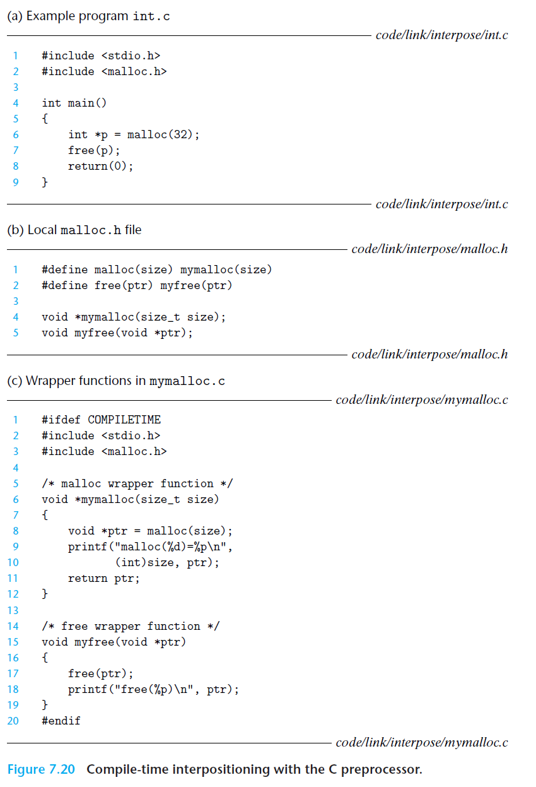
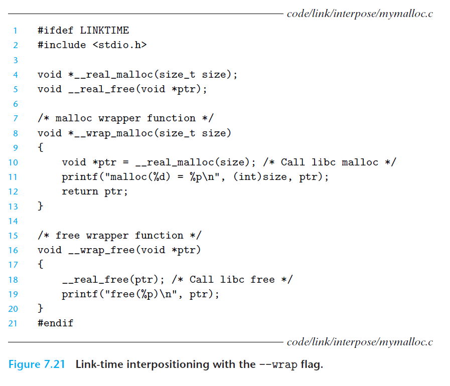

# Ch7 Linking

## 7.13 Library Interpositioning

Linux 链接器支持库打桩（library interpositioning）技术，其允许将某些共享库的调用转变为自己编写的代码。使用该机制，可以跟踪对某个特殊库函数的调用次数，验证和追踪其输入输出值，还可以将其替换为其它不同的实现。

打桩通过欺骗系统调用，将目标函数替换为自己编写的包装函数。

### Compile-Time Interpositioning

编译时打桩：如下图，通过预处理器将目标函数的调用替换为包装函数。

编译和来了解指令分别为 `gcc -DCOMPLETIME -c mymalloc.c` 、`gcc -I. -o intc int.c mymalloc.o`

### Link-Time Interpositioning

链接时打桩：Linux 静态链接器支持使用 `--warp f` 标志进行链接时打桩，该标志告诉链接器，将 f 的符号引用解析成 `__warp_f` ，将符号 `__real_f` 的引用解析为 f。

如下图所示，编译、连接的步骤如下：

1. `gcc -DLINKTIME -c mymalloc.c`
2. `gcc -c int.c`
3. `gcc -Wl,--warp, malloc -Wl, --warp,free -o intl int.o mymalloc.o` ；其中，`-Wl, option`会将 `option` 标志传递给链接器，option 中的逗号会替换为一个空格。

