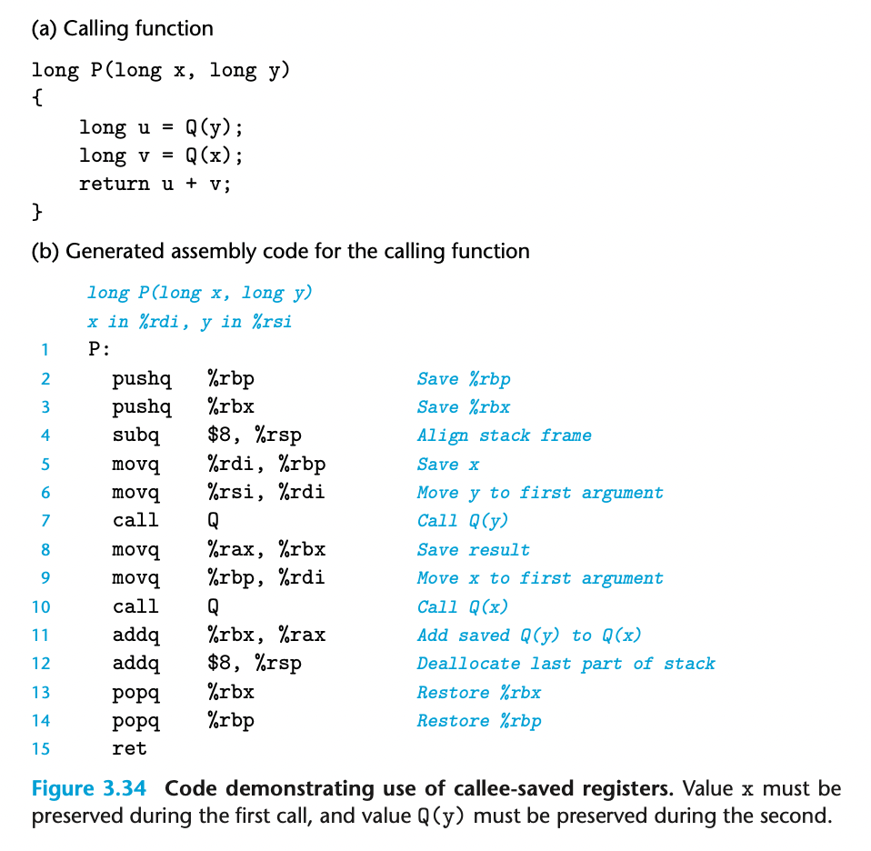

The set of program registers acts as a single resource shared by all of the proce- dures. Although only one procedure can be active at a given time, we must make sure that when one procedure (the *caller*) calls another (the *callee*), the callee does not overwrite some register value that the caller planned to use later. For this rea- son, x86-64 adopts a uniform set of conventions for register usage that must be respected by all procedures, including those in program libraries.

By convention, registers %rbx, %rbp, and %r12–%r15 are classified as *callee- saved* registers. When procedure P calls procedure Q, Q must *preserve* the values of these registers, ensuring that they have the same values when Q returns to P as they did when Q was called. Procedure Q can preserve a register value by either not changing it at all or by pushing the original value on the stack, altering it, and then popping the old value from the stack before returning. The pushing of register values has the effect of creating the portion of the stack frame labeled “Saved registers” in Figure 3.25. With this convention, the code for P can safely store a value in a callee-saved register (after saving the previous value on the stack, of course), call Q, and then use the value in the register without risk of it having been corrupted.

All other registers, except for the stack pointer %rsp, are classified as *caller- saved* registers. This means that they can be modified by any function. The name “caller saved” can be understood in the context of a procedure P having some local data in such a register and calling procedure Q. Since Q is free to alter this register, it is incumbent upon P (the caller) to first save the data before it makes the call.

As an example, consider the function P shown in Figure 3.34(a). It calls Q twice. During the first call, it must retain the value of x for use later. Similarly, during the second call, it must retain the value computed for Q(y). In Figure 3.34(b),

we can see that the code generated by gcc uses two callee-saved registers: %rbp to hold x, and %rbx to hold the computed value of Q(y). At the beginning of the function, it saves the values of these two registers on the stack (lines 2–3). It copies argument x to %rbp before the first call to Q (line 5). It copies the result of this call to %rbx before the second call to Q (line 8). At the end of the function (lines 13– 14), it restores the values of the two callee-saved registers by popping them off the stack. Note how they are popped in the reverse order from how they were pushed, to account for the last-in, first-out discipline of a stack.

