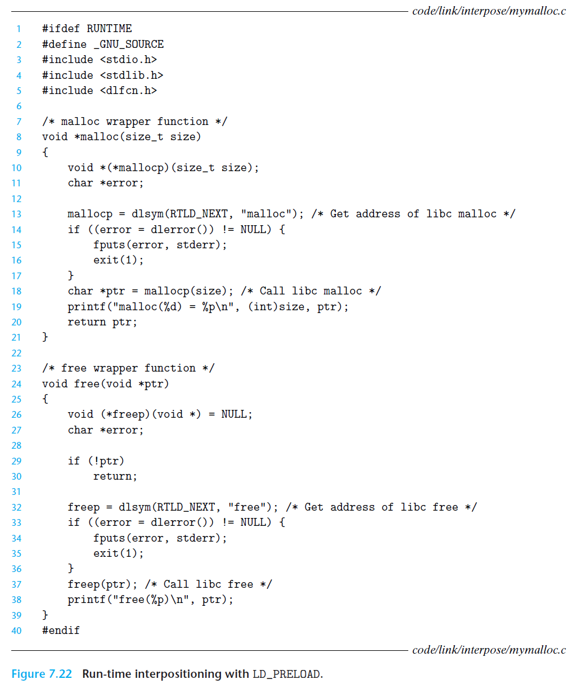

# Ch7 Linking

## 7.13 Library Interpositioning

### Run-Time Interpositioning

编译时打桩需要访问程序的源代码；链接时打桩需要能够访问程序的可重定位对象文件；运行时打桩仅需访问可执行目标文件，其基于动态链接器的 `LD_PRELOAD` 环境变量。

将 `LD_PRELOAD`环境变量设置为一个共享库路径名的列表时，在加载一个程序时，需要解析未定义的引用是，动态链接器（`LD-LINUX.SO`）首先会搜索`LD_PRELOAD`库，然后才搜索其它库。借助该机制，加载和执行任意可执行文件时，可以对任何共享库中的任何函数进行打桩。

构建包含包装函数库的共享库的命令：`gcc -DRUNTIME -shared -fpic -o mymalloc.so mymalloc.c -ldl` 

编译主程序 `gcc -o intr int.c`

从 bash 中下运行 `LD_PRELOAD="./mymalloc.so ./intr"`

