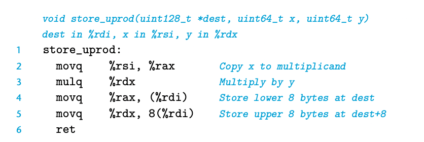

The imulq instruction has two different forms One form, shown in Figure 3.10, is as a member of the imul instruction class. In this form, it serves as a “two- operand” multiply instruction, generating a 64-bit product from two 64-bit oper- ands. It implements the operations *u64 and *t64 described in Sections 2.3.4 and 2.3.5. (Recall that when truncating the product to 64 bits, both unsigned multiply and two’s-complement multiply have the same bit-level behavior.)

Additionally, the x86-64 instruction set includes two different “one-operand” multiply instructions to compute the full 128-bit product of two 64-bit values— one for unsigned (mulq) and one for two’s-complement (imulq) multiplication. For both of these instructions, one argument must be in register %rax, and the other is given as the instruction source operand. The product is then stored in registers %rdx (high-order 64 bits) and %rax (low-order 64 bits). Although the name imulq is used for two distinct multiplication operations, the assembler can tell which one is intended by counting the number of operands.

As an example, the following C code demonstrates the generation of a 128-bit product of two unsigned 64-bit numbers x and y:

```c
#include <inttypes.h>
typedef unsigned __int128 uint128_t;
void store_uprod(uint128_t *dest, uint64_t x, uint64_t y) {
    *dest = x * (uint128_t) y;
}
```

In this program, we explicitly declare x and y to be 64-bit numbers, using defi- nitions declared in the file inttypes.h , as part of an extension of the C standard. Unfortunately, this standard does not make provisions for 128-bit values. Instead,

we rely on support provided by gcc for 128-bit integers, declared using the name __int128. Our code uses a typedef declaration to define data type uint128_t, following the naming pattern for other data types found in inttypes.h. The code specifies that the resulting product should be stored at the 16 bytes designated by pointer dest.

The assembly code generated by gcc for this function is as follows:



Observe that storing the product requires two movq instructions: one for the low-order 8 bytes (line 4), and one for the high-order 8 bytes (line 5). Since the code is generated for a little-endian machine, the high-order bytes are stored at higher addresses, as indicated by the address specification 8(%rdi).

Our earlier table of arithmetic operations (Figure 3.10) does not list any division or modulus operations. These operations are provided by the single- operand divide instructions similar to the single-operand multiply instructions. The signed division instruction idivl takes as its dividend the 128-bit quantity in registers %rdx (high-order 64 bits) and %rax (low-order 64 bits). The divisor is given as the instruction operand. The instruction stores the quotient in register %rax and the remainder in register %rdx.

For most applications of 64-bit addition, the dividend is given as a 64-bit value. This value should be stored in register %rax. The bits of %rdx should then be set to either all zeros (unsigned arithmetic) or the sign bit of %rax (signed arithmetic). The latter operation can be performed using the instruction cqto.2 This instruction takes no operands—it implicitly reads the sign bit from %rax and copies it across all of %rdx.