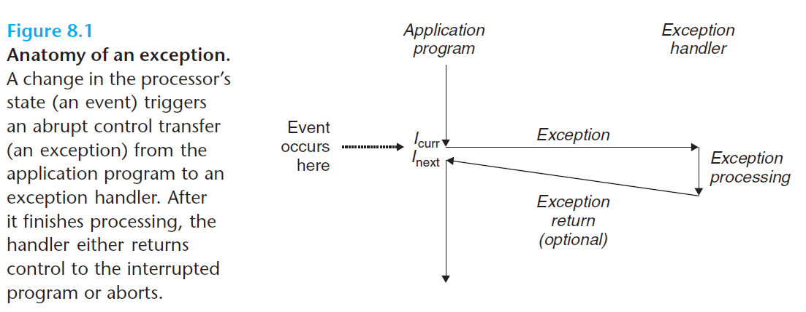

# Ch8 Exceptional Control Flow

## 8.1 Exceptions

异常是异常控制流的一种形式，由硬件和操作系统共同实现。异常是控制流中的突变，用于相应处理器状态中的某些变化。

如下图，处理器正在执行指令 $I_{curr}$ ，其状态变化称为事件。

* 事件可能和当前执行的执行直接相关。例如，虚拟内存缺页、算术溢出、除 0 运算；
* 事件可能和当前执行的执行无关。例如，系统定时器信号、I/O请求完成。

任何情况下，处理器检测到有事件发生时，其会通过异常表（exception table）的跳转表，在表中找到对应的异常处理程序来处理特定的异常。异常处理完毕后，会发生以下情况的一种：

1. 处理程序将控制返回给当前指令$I_{curr}$；
2. 处理程序将控制返回给$I_{next}$；
3. 处理程序终止被中断的程序。