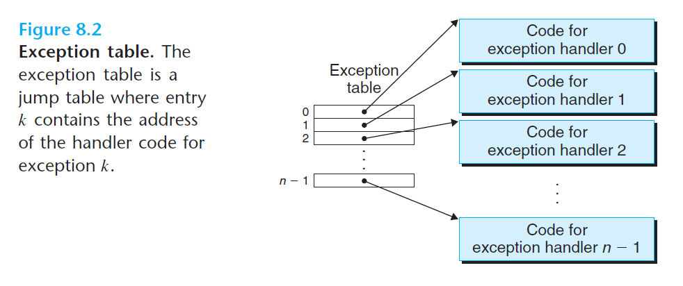
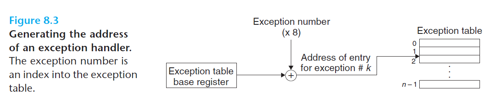

# Ch8 Exceptional Control Flow

## 8.1 Exceptions

### 8.1.1 Exception Handling

系统中为每种类型的异常都分配了唯一的非负整数的异常号（exception number），异常号的分配由**处理器架构**和**操作系统内核**共同设计分配的，处理器中的异常有被除零、缺页、内存访问违法、断点及算术运算移出，操作系统内核中的异常包括了系统调用和来自外部I/O设备的信号。

操作系统启动时，会分配并初始化一张异常表，表中的条目包括了对应异常号处理程序的地址。如下图所示。

如下图所示，如果处理器检测到了异常事件并确定了相应的异常号，随后处理器会触发异常，该过程如下：借助于异常表找到对应异常号的处理程序。另外，异常表的起始地址放在异常表基址寄存器（exception table base register）的特殊 CPU 寄存器中。

异常和函数调用的不同之处：

* 函数调用需要压栈，而异常的返回地址一般是当前指令或者下一条指令。
* 异常处理时会将某些处理器状态压入栈中，在异常处理完成时，会回复这些状态。例如 X86 系统会将当前条件码的 EFLAGS 寄存器和其它内容压入栈中。
* 如果控制用户程序转移到内核，所有的项目会被压入内核栈中。
* 异常处理程序运行在内核模型下，拥有系统资源的完全访问权限。

异常完成后，会执行一条特殊的“从中断返回”指令返回到被中断的程序，该指令会将压栈内容全部弹出；如果中断的时用户态程序，会恢复到用户态。

