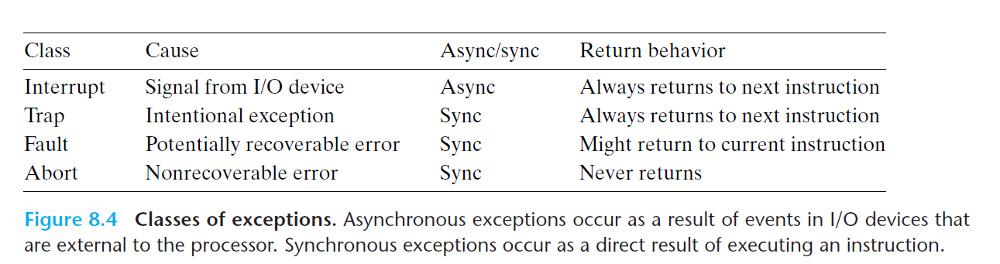
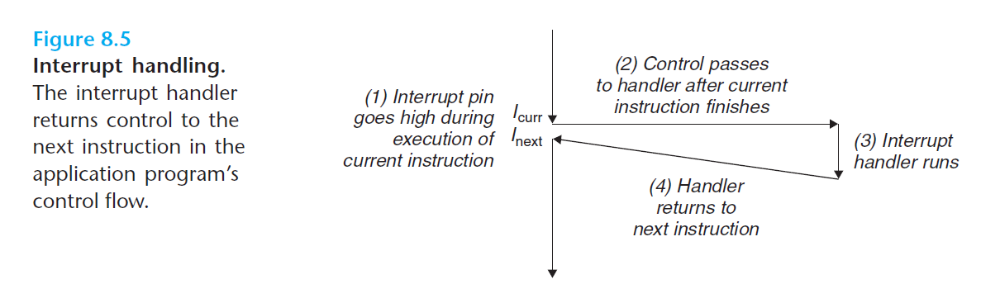
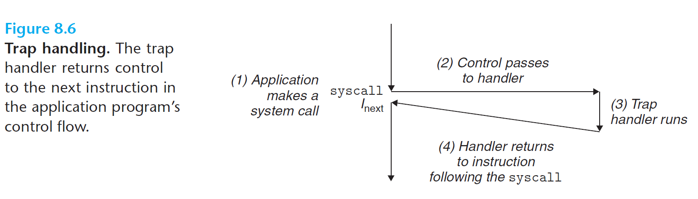
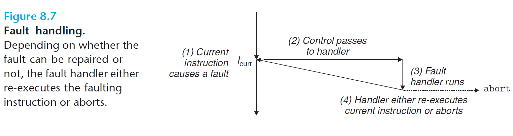
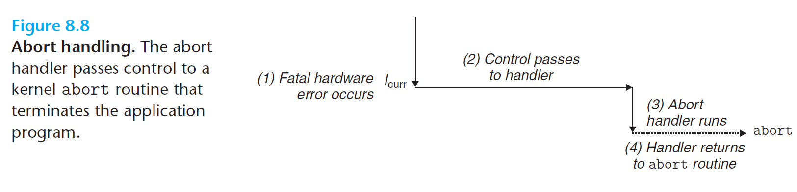

# Ch8 Exceptional Control Flow

## 8.1 Exceptions

### 8.1.2 Classes of Exceptions

异常分为四种，分别为中断、陷阱、故障、终止。

#### 1. 中断

中断是异步发生的，来自于处理器外部的 I/O 设备的信号。触发和处理中断的流程如下：

1. I/O 设备（例如网络适配器、磁盘控制器等）会向处理器芯片的一个引脚上发信号，并将异常号放在系统总线上以触发中断，这个异常号标识呢引起中断的设备。
2. 当前指令执行完毕后，处理器注意到中断引脚的电压变高后，从系统总线读取异常号，交给特定的中断处理程序。
3. 当中断处理程序完成后，将控制返回给下一条指令。

#### 2. 陷阱

陷阱是有意的异常，是执行一条指令的结果。陷阱常用来给用户态和内核态的交互提供**系统调用**接口。过程如下：程序想要请求内核服务时，可以执行`syscall n` 的指令，该指令会导致一个异常处理程序的陷阱，该处理程序解析参数，并调用适当的内核程序。

#### 3. 故障

故障由错误情况引起，其能够被故障处理程序修正。过程如下：故障发生时，处理器将控制转移给故障处理程序，如果处理程序能够修正该错误情况，其会将控制返回给引起故障的指令并重新执行该指令；否则，处理程序会调用内核中的 `abort` 例程，从而终止引起故障的应用程序。

例如，缺页异常的处理。

#### 4. 终止

终止是不可恢复的致命错误造成的结果，通常是硬件错误（例如 DRAM 或 SRAM位被损坏时发生的奇偶错误），终止程序不会将控制交给应用程序。

