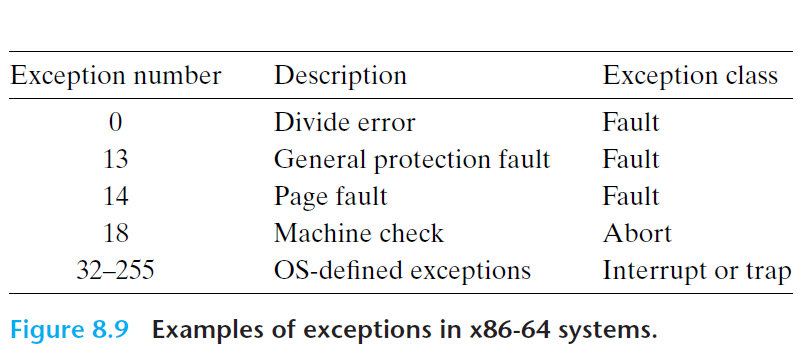
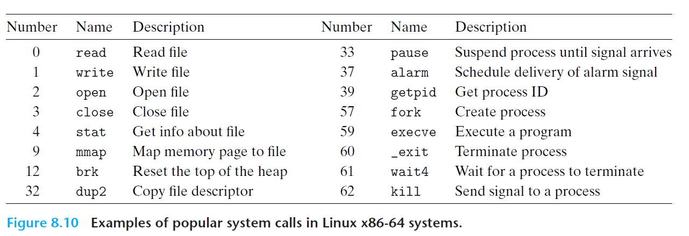
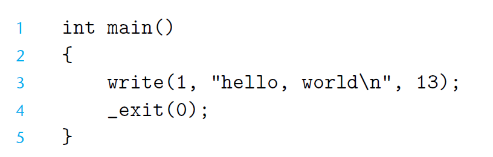
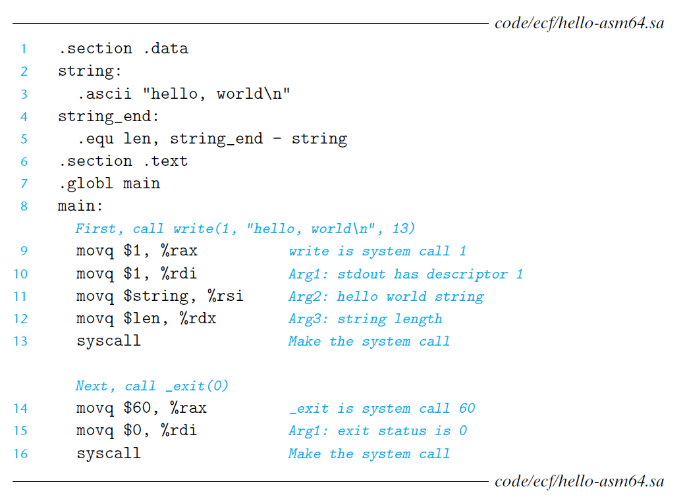

# Ch8 Exceptional Control Flow

## 8.1 Exceptions

### 8.1.3 Exceptions in Linux/x86-64 Systems

X86-64 系统定义了 256 种异常，其中，0-31的异常号是由 Intel 架构所送一的，32-255的异常号是由操作系统所定义的中断和陷阱。

#### 1. Linux/x86-64 Faults and Aborts

* Divide error：除0 或者除法指令的结果对于目标操作数来说太大了，发生异常号为 0 的触发错误，Unix 对于除法错误直接选择中止程序。
* General protection fault：通常由程序引用了一个未定义的虚拟内存区域或者程序试图写一个只读的文本段，Linux 不会恢复这类故障，直接显示 Segmentation Fault 故障。
* Page fault：缺页异常时，程序会见磁盘上的虚拟内存页映射到物理内存页，然后重新执行产生这条故障的指令。
* Machine check：导致故障的指令执行中检测到致命的硬件错误时发生的。

#### 2. Linux/x86-64 System Calls

Linux 系统调用都有唯一的整数号，对应了一个到内核中跳转表的偏移量（该跳转表和异常的跳转表不一样）。

C 程序调用 `syscall` 函数来直接调用系统调用，在实际运用中，标准 C 库已经将其封装好。

Linux 系统调用的参数是通过寄存器来传递的，按照惯例，`%rax` 包含系统调用号，`%rdi`、`%rsi`、`%rdx`、`%r10`、`%r8`、`%r9` 这六个寄存器用于传递参数。从系统调用返回时，寄存器 `%rcx` 和 `%r11` 会被破坏，`%rax` 包含了返回值，若返回值位于 -4095 到 -1 区间则表明发生了错误，对应于负的 errno。

下图中展示了一些系统调用号。

系统调用到汇编的翻译如下图：

