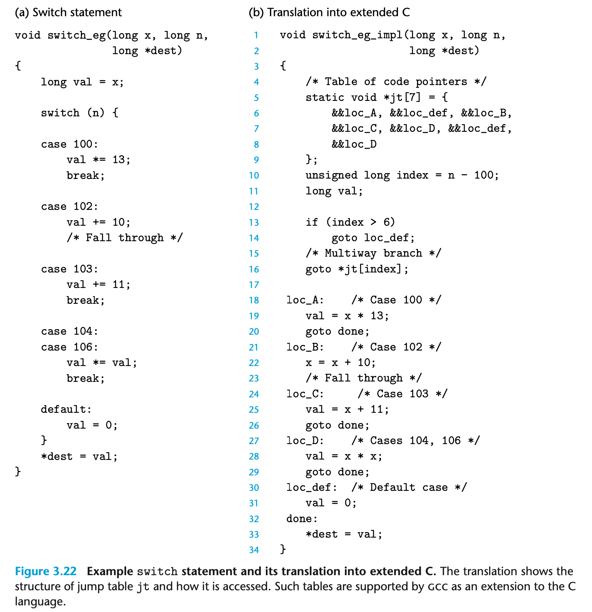
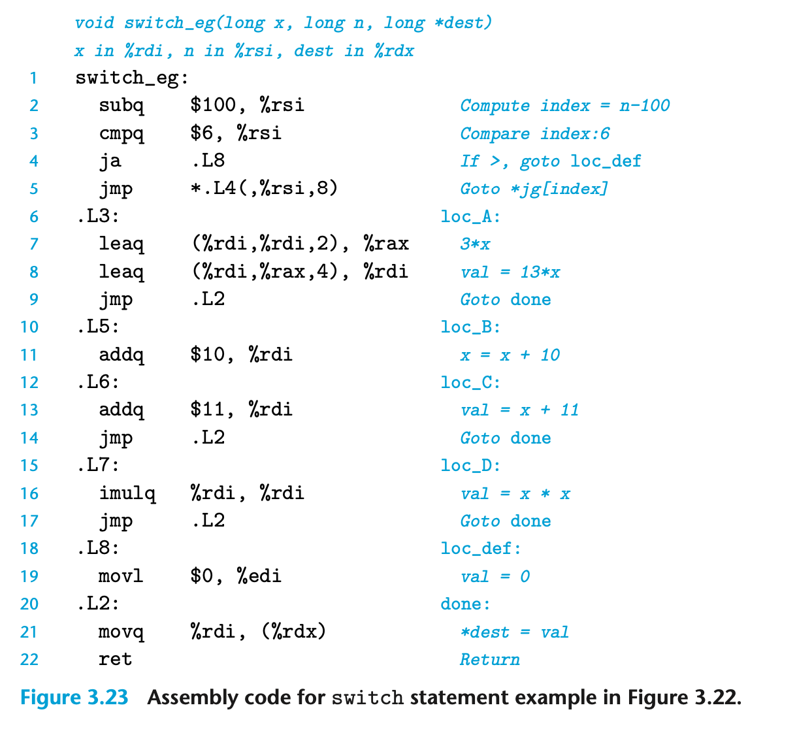
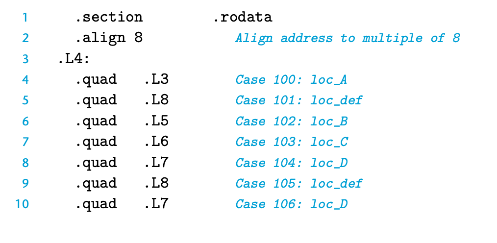

# Switch Statements

A switch statement provides a multiway branching capability based on the value of an integer index. They are particularly useful when dealing with tests where there can be a large number of possible outcomes. Not only do they make the C code more readable, but they also allow an efficient implementation using a data structure called a *jump table*. A jump table is an array where entry i is the address of a code segment implementing the action the program should take when the switch index equals i. The code performs an array reference into the jump table using the switch index to determine the target for a jump instruction. The advantage of using a jump table over a long sequence of if-else statements is that the time taken to perform the switch is independent of the number of switch cases. Gcc selects the method of translating a switch statement based on the number of cases and the sparsity of the case values. Jump tables are used when there are a number of cases (e.g., four or more) and they span a small range of values.

Figure 3.22(a) shows an example of a C switch statement. This example has a number of interesting features, including case labels that do not span a contiguous range (there are no labels for cases 101 and 105), cases with multiple labels (cases 104 and 106), and cases that *fall through* to other cases (case 102) because the code for the case does not end with a break statement.

Figure 3.23 shows the assembly code generated when compiling switch_eg. The behavior of this code is shown in C as the procedure switch_eg_impl in Figure 3.22(b). This code makes use of support provided by gcc for jump tables, as an extension to the C language. The array jt contains seven entries, each of which is the address of a block of code. These locations are defined by labels in the code and indicated in the entries in jt by code pointers, consisting of the labels prefixed by &&. (Recall that the operator ‘&’ creates a pointer for a data value. In making this extension, the authors of gcc created a new operator && to create a pointer for a code location.) We recommend that you study the C procedure switch_eg_impl and how it relates to the assembly-code version.

Our original C code has cases for values 100, 102–104, and 106, but the switch variable n can be an arbitrary integer. The compiler first shifts the range to between 0 and 6 by subtracting 100 from n, creating a new program variable that we call index in our C version. It further simplifies the branching possibilities by treating index as an *unsigned* value, making use of the fact that negative numbers in a two’s-complement representation map to large positive numbers in an unsigned representation. It can therefore test whether index is outside of the range 0–6 by testing whether it is greater than 6. In the C and assembly code, there are five distinct locations to jump to, based on the value of index. These are loc_A (identified in the assembly code as .L3), loc_B (.L5), loc_C (.L6), loc_D (.L7), and loc_def (.L8), where the latter is the destination for the default case. Each of these labels identifies a block of code implementing one of the case branches. In both the C and the assembly code, the program compares index to 6 and jumps to the code for the default case if it is greater.

The key step in executing a switch statement is to access a code location through the jump table. This occurs in line 16 in the C code, with a goto statement that references the jump table jt. This *computed goto* is supported by gcc as an extension to the C language. In our assembly-code version, a similar operation occurs on line 5, where the jmp instruction’s operand is prefixed with ‘*’, indicating an indirect jump, and the operand specifies a memory location indexed by register %eax, which holds the value of index. (We will see in Section 3.8 how array references are translated into machine code.)

Our C code declares the jump table as an array of seven elements, each of which is a pointer to a code location. These elements span values 0–6 of index, corresponding to values 100–106 of n. Observe that the jump table handles duplicate cases by simply having the same code label (loc_D) for entries 4 and 6, and it handles missing cases by using the label for the default case (loc_def) as entries 1 and 5.

In the assembly code, the jump table is indicated by the following declarations, to which we have added comments:

These declarations state that within the segment of the object-code file called .rodata (for “read-only data”), there should be a sequence of seven “quad” (8- byte) words, where the value of each word is given by the instruction address associated with the indicated assembly-code labels (e.g., .L3). Label .L4 marks the start of this allocation. The address associated with this label serves as the base for the indirect jump (line 5).

The different code blocks (C labels loc_A through loc_D and loc_def) im- plement the different branches of the switch statement. Most of them simply compute a value for val and then go to the end of the function. Similarly, the assembly-code blocks compute a value for register %rdi and jump to the position indicated by label .L2 at the end of the function. Only the code for case label 102 does not follow this pattern, to account for the way the code for this case falls through to the block with label 103 in the original C code. This is handled in the assembly-code block starting with label .L5, by omitting the jmp instruction at the end of the block, so that the code continues execution of the next block. Simi- larly, the C version switch_eg_impl has no goto statement at the end of the block starting with label loc_B.