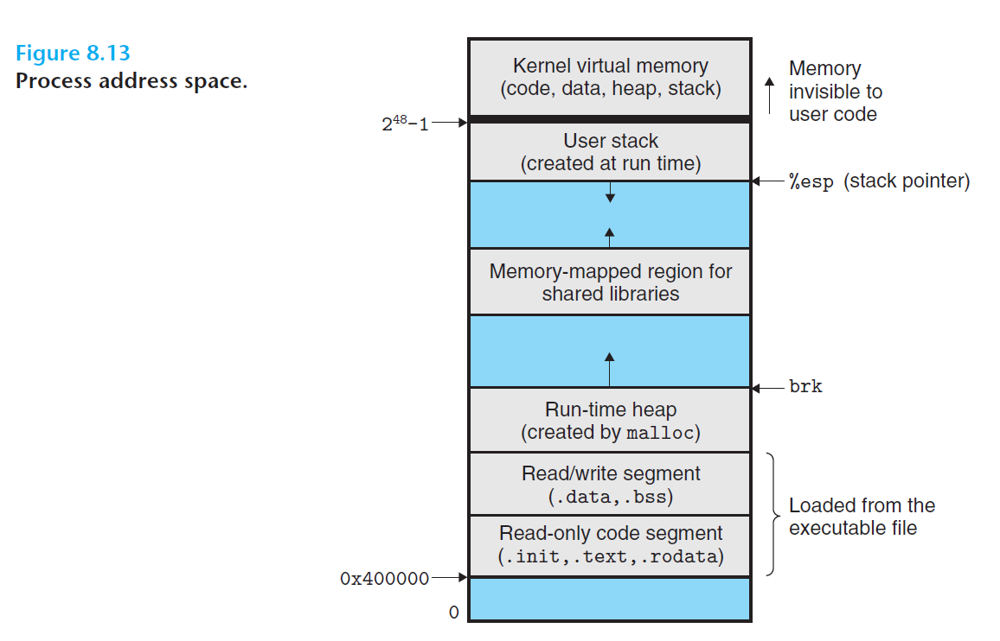

# Ch8 Exceptional Control Flow

## 8.2 Processes

### 8.2.3 Private Address Space

进程的地址空间是私有的，下图为 X86-64 Linux 进程地址空间的组织结构：

* 地址空间底部保留给用户程序，包括代码、数据、堆和栈；
* 代码段从地址 `0X400000`开始；
* 地址空间顶部保留给内核，包含了内核在代表进程执行指令时使用的代码、数据和栈。

